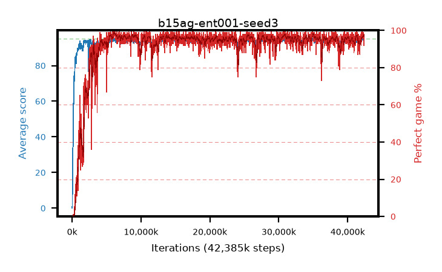

# b15ag-ent001-seed3

step **42,385,408** · 2579 evals · trailing **94.24** · peak **94.47** @6,193,152 · sef **93.0** · best30 **98.2** @6,275,072

## Config

| | |
|---|---|
| algo | ppo |
| collect_envs | 128 |
| discount | 0.99 |
| eval_interval | 16384 |
| eval_queue | True |
| eval_queue_depth | 16 |
| eval_workers | 8 |
| fc_layers | (320,) |
| graph_eval_episodes | 100 |
| max_steps | 50003968 |
| min_checkpoint_score | 40.0 |
| ppo_adam_epsilon | 1e-07 |
| ppo_anneal_fraction | 1.0 |
| ppo_clip | 0.2 |
| ppo_clip_final | None |
| ppo_entropy_coef | 0.001 |
| ppo_entropy_coef_final | None |
| ppo_epochs | 4 |
| ppo_gae_lambda | 0.98 |
| ppo_gradient_clipping | 0.5 |
| ppo_horizon | 33.6 |
| ppo_learning_rate | 0.0003 |
| ppo_learning_rate_final | None |
| ppo_minibatch | 256 |
| ppo_normalize_adv | True |
| ppo_rollout | 128 |
| ppo_target_kl | 0.0 |
| ppo_transitions_per_rollout | 16384 |
| ppo_value_loss | huber |
| ppo_vf_coef | 0.5 |
| seed | 3 |
| torch_threads | 1 |

## Evals

| step | avg score | trailing avg | min score | max score | avg reward | perfect % | epsilon |
|---|---|---|---|---|---|---|---|
| 16384 | 0.09 | 0.09 | 0.0 | 1.0 | -3.425 | 0.0 |  |
| 32768 | 1.96 | 1.02 | 0.0 | 9.0 | 1.415 | 0.0 |  |
| 49152 | 19.79 | 7.28 | 3.0 | 35.0 | 15.015 | 0.0 |  |
| ... | ... | ... | ... | ... | ... | ... | ... |
| 42074112 | 95.0 | 94.17 | 95.0 | 95.0 | 194.0 | 100.0 |  |
| 42090496 | 94.79 | 94.15 | 86.0 | 95.0 | 189.81 | 96.0 |  |
| 42106880 | 94.28 | 94.16 | 66.0 | 95.0 | 189.3 | 96.0 |  |
| 42123264 | 94.6 | 94.21 | 71.0 | 95.0 | 190.615 | 97.0 |  |
| 42139648 | 94.54 | 94.24 | 62.0 | 95.0 | 191.505 | 98.0 |  |
| 42254336 | 94.32 | 94.15 | 63.0 | 95.0 | 189.295 | 96.0 |  |
| 42270720 | 94.73 | 94.22 | 68.0 | 95.0 | 192.735 | 99.0 |  |
| 42287104 | 94.41 | 94.26 | 60.0 | 95.0 | 190.425 | 97.0 |  |
| 42336256 | 94.34 | 94.24 | 56.0 | 95.0 | 191.35 | 98.0 |  |
| 42352640 | 94.2 | 94.25 | 56.0 | 95.0 | 190.17 | 97.0 |  |
| 42369024 | 93.27 | 94.24 | 16.0 | 95.0 | 184.31 | 92.0 |  |
| 42385408 | 94.49 | 94.24 | 68.0 | 95.0 | 189.51 | 96.0 |  |
