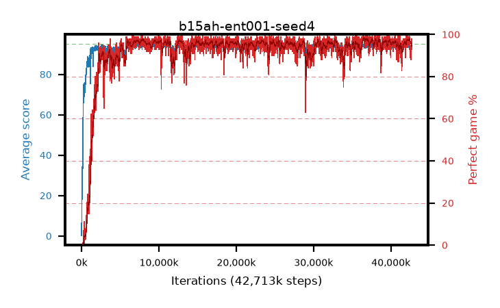

# b15ah-ent001-seed4

step **42,713,088** · 2598 evals · trailing **94.17** · peak **94.4** @8,208,384 · sef **94.6** · best30 **97.8** @36,732,928

## Config

| | |
|---|---|
| algo | ppo |
| collect_envs | 128 |
| discount | 0.99 |
| eval_interval | 16384 |
| eval_queue | True |
| eval_queue_depth | 16 |
| eval_workers | 8 |
| fc_layers | (320,) |
| graph_eval_episodes | 100 |
| max_steps | 50003968 |
| min_checkpoint_score | 40.0 |
| ppo_adam_epsilon | 1e-07 |
| ppo_anneal_fraction | 1.0 |
| ppo_clip | 0.2 |
| ppo_clip_final | None |
| ppo_entropy_coef | 0.001 |
| ppo_entropy_coef_final | None |
| ppo_epochs | 4 |
| ppo_gae_lambda | 0.98 |
| ppo_gradient_clipping | 0.5 |
| ppo_horizon | 33.6 |
| ppo_learning_rate | 0.0003 |
| ppo_learning_rate_final | None |
| ppo_minibatch | 256 |
| ppo_normalize_adv | True |
| ppo_rollout | 128 |
| ppo_target_kl | 0.0 |
| ppo_transitions_per_rollout | 16384 |
| ppo_value_loss | huber |
| ppo_vf_coef | 0.5 |
| seed | 4 |
| torch_threads | 1 |

## Evals

| step | avg score | trailing avg | min score | max score | avg reward | perfect % | epsilon |
|---|---|---|---|---|---|---|---|
| 16384 | 0.21 | 0.21 | 0.0 | 2.0 | -0.605 | 0.0 |  |
| 32768 | 17.16 | 17.14 | 2.0 | 33.0 | 12.7 | 0.0 |  |
| 49152 | 25.28 | 12.75 | 9.0 | 44.0 | 20.28 | 0.0 |  |
| ... | ... | ... | ... | ... | ... | ... | ... |
| 42385408 | 94.95 | 94.11 | 90.0 | 95.0 | 192.955 | 99.0 |  |
| 42401792 | 94.64 | 94.25 | 62.0 | 95.0 | 191.65 | 98.0 |  |
| 42418176 | 93.72 | 94.29 | 6.0 | 95.0 | 188.74 | 96.0 |  |
| 42434560 | 94.14 | 94.31 | 23.0 | 95.0 | 190.11 | 97.0 |  |
| 42450944 | 94.16 | 94.17 | 75.0 | 95.0 | 186.15 | 93.0 |  |
| 42565632 | 93.07 | 94.24 | 39.0 | 95.0 | 180.04 | 88.0 |  |
| 42582016 | 94.2 | 94.19 | 76.0 | 95.0 | 187.185 | 94.0 |  |
| 42647552 | 93.34 | 94.22 | 26.0 | 95.0 | 185.375 | 93.0 |  |
| 42663936 | 93.84 | 94.18 | 61.0 | 95.0 | 185.875 | 93.0 |  |
| 42680320 | 94.05 | 94.17 | 65.0 | 95.0 | 188.075 | 95.0 |  |
| 42696704 | 94.11 | 94.14 | 60.0 | 95.0 | 190.125 | 97.0 |  |
| 42713088 | 94.59 | 94.17 | 65.0 | 95.0 | 191.6 | 98.0 |  |
