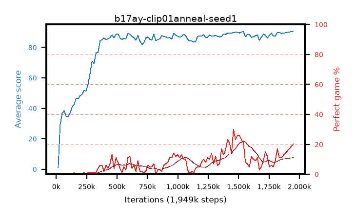

# b17ay-clip01anneal-seed1

step **1,949,696** · 114 evals · trailing **88.54** · peak **88.54** @1,949,696 · sef **0.0** · best30 **13.8** @1,736,704

## Config

| | |
|---|---|
| algo | ppo |
| collect_envs | 128 |
| discount | 0.99 |
| eval_interval | 16384 |
| eval_queue | True |
| eval_queue_depth | 16 |
| eval_workers | 8 |
| fc_layers | (320,) |
| graph_eval_episodes | 100 |
| max_steps | 50003968 |
| min_checkpoint_score | 40.0 |
| ppo_adam_epsilon | 1e-07 |
| ppo_anneal_fraction | 1.0 |
| ppo_clip | 0.1 |
| ppo_clip_final | 0.02 |
| ppo_entropy_coef | 0.01 |
| ppo_entropy_coef_final | None |
| ppo_epochs | 4 |
| ppo_gae_lambda | 0.98 |
| ppo_gradient_clipping | 0.5 |
| ppo_horizon | 33.6 |
| ppo_learning_rate | 0.0003 |
| ppo_learning_rate_final | None |
| ppo_minibatch | 256 |
| ppo_normalize_adv | True |
| ppo_rollout | 128 |
| ppo_target_kl | 0.0 |
| ppo_transitions_per_rollout | 16384 |
| ppo_value_loss | huber |
| ppo_vf_coef | 0.5 |
| seed | 1 |
| torch_threads | 1 |

## Evals

| step | avg score | trailing avg | min score | max score | avg reward | perfect % | epsilon |
|---|---|---|---|---|---|---|---|
| 16384 | 1.15 | 1.15 | 0.0 | 3.0 | -3.815 | 0.0 |  |
| 32768 | 29.37 | 15.26 | 10.0 | 62.0 | 26.286 | 0.0 |  |
| 49152 | 36.81 | 22.44 | 13.0 | 61.0 | 31.718 | 0.0 |  |
| ... | ... | ... | ... | ... | ... | ... | ... |
| 1687552 | 86.69 | 88.02 | 14.0 | 95.0 | 90.313 | 5.0 |  |
| 1703936 | 88.71 | 88.33 | 66.0 | 95.0 | 96.21 | 9.0 |  |
| 1720320 | 88.03 | 88.51 | 30.0 | 95.0 | 101.605 | 15.0 |  |
| 1736704 | 86.23 | 88.1 | 8.0 | 95.0 | 96.79 | 12.0 |  |
| 1753088 | 88.04 | 88.08 | 44.0 | 95.0 | 91.606 | 5.0 |  |
| 1769472 | 89.28 | 88.14 | 66.0 | 95.0 | 93.796 | 6.0 |  |
| 1785856 | 87.41 | 88.16 | 48.0 | 95.0 | 91.023 | 5.0 |  |
| 1802240 | 87.5 | 88.05 | 10.0 | 95.0 | 95.024 | 9.0 |  |
| 1818624 | 89.75 | 88.42 | 50.0 | 95.0 | 105.282 | 17.0 |  |
| 1835008 | 89.77 | 88.28 | 80.0 | 95.0 | 99.333 | 11.0 |  |
| 1851392 | 89.16 | 88.22 | 76.0 | 95.0 | 98.738 | 11.0 |  |
| 1949696 | 90.58 | 88.54 | 78.0 | 95.0 | 109.15 | 20.0 |  |
