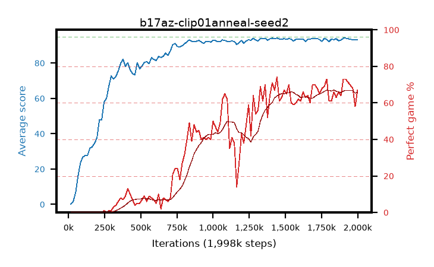

# b17az-clip01anneal-seed2

step **1,998,848** · 120 evals · trailing **93.35** · peak **93.45** @1,458,176 · sef **0.0** · best30 **65.5** @1,916,928

## Config

| | |
|---|---|
| algo | ppo |
| collect_envs | 128 |
| discount | 0.99 |
| eval_interval | 16384 |
| eval_queue | True |
| eval_queue_depth | 16 |
| eval_workers | 8 |
| fc_layers | (320,) |
| graph_eval_episodes | 100 |
| max_steps | 50003968 |
| min_checkpoint_score | 40.0 |
| ppo_adam_epsilon | 1e-07 |
| ppo_anneal_fraction | 1.0 |
| ppo_clip | 0.1 |
| ppo_clip_final | 0.02 |
| ppo_entropy_coef | 0.01 |
| ppo_entropy_coef_final | None |
| ppo_epochs | 4 |
| ppo_gae_lambda | 0.98 |
| ppo_gradient_clipping | 0.5 |
| ppo_horizon | 33.6 |
| ppo_learning_rate | 0.0003 |
| ppo_learning_rate_final | None |
| ppo_minibatch | 256 |
| ppo_normalize_adv | True |
| ppo_rollout | 128 |
| ppo_target_kl | 0.0 |
| ppo_transitions_per_rollout | 16384 |
| ppo_value_loss | huber |
| ppo_vf_coef | 0.5 |
| seed | 2 |
| torch_threads | 1 |

## Evals

| step | avg score | trailing avg | min score | max score | avg reward | perfect % | epsilon |
|---|---|---|---|---|---|---|---|
| 16384 | 0.12 | 0.12 | 0.0 | 2.0 | -4.259 | 0.0 |  |
| 32768 | 1.78 | 0.95 | 0.0 | 6.0 | -0.471 | 0.0 |  |
| 49152 | 6.82 | 8.05 | 0.0 | 21.0 | 3.209 | 0.0 |  |
| ... | ... | ... | ... | ... | ... | ... | ... |
| 1785856 | 93.29 | 93.38 | 32.0 | 95.0 | 164.851 | 73.0 |  |
| 1802240 | 92.16 | 93.37 | 28.0 | 95.0 | 151.792 | 61.0 |  |
| 1818624 | 93.54 | 93.42 | 86.0 | 95.0 | 153.162 | 61.0 |  |
| 1835008 | 93.21 | 93.31 | 24.0 | 95.0 | 157.835 | 66.0 |  |
| 1851392 | 93.81 | 93.39 | 88.0 | 95.0 | 155.406 | 63.0 |  |
| 1867776 | 92.59 | 93.38 | 36.0 | 95.0 | 157.208 | 66.0 |  |
| 1884160 | 92.93 | 93.39 | 8.0 | 95.0 | 155.541 | 64.0 |  |
| 1900544 | 94.09 | 93.45 | 88.0 | 95.0 | 165.689 | 73.0 |  |
| 1916928 | 94.06 | 93.37 | 88.0 | 95.0 | 165.651 | 73.0 |  |
| 1966080 | 93.19 | 93.41 | 28.0 | 95.0 | 159.751 | 68.0 |  |
| 1982464 | 93.23 | 93.36 | 52.0 | 95.0 | 149.823 | 58.0 |  |
| 1998848 | 93.22 | 93.35 | 30.0 | 95.0 | 158.839 | 67.0 |  |
