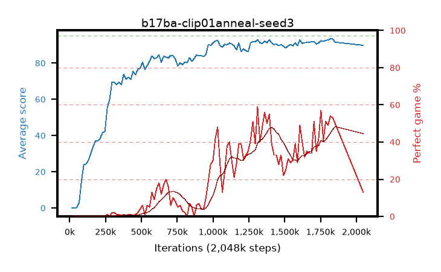

# b17ba-clip01anneal-seed3

step **2,048,000** · 114 evals · trailing **91.06** · peak **91.13** @1,687,552 · sef **0.0** · best30 **39.6** @1,835,008

## Config

| | |
|---|---|
| algo | ppo |
| collect_envs | 128 |
| discount | 0.99 |
| eval_interval | 16384 |
| eval_queue | True |
| eval_queue_depth | 16 |
| eval_workers | 8 |
| fc_layers | (320,) |
| graph_eval_episodes | 100 |
| max_steps | 50003968 |
| min_checkpoint_score | 40.0 |
| ppo_adam_epsilon | 1e-07 |
| ppo_anneal_fraction | 1.0 |
| ppo_clip | 0.1 |
| ppo_clip_final | 0.02 |
| ppo_entropy_coef | 0.01 |
| ppo_entropy_coef_final | None |
| ppo_epochs | 4 |
| ppo_gae_lambda | 0.98 |
| ppo_gradient_clipping | 0.5 |
| ppo_horizon | 33.6 |
| ppo_learning_rate | 0.0003 |
| ppo_learning_rate_final | None |
| ppo_minibatch | 256 |
| ppo_normalize_adv | True |
| ppo_rollout | 128 |
| ppo_target_kl | 0.0 |
| ppo_transitions_per_rollout | 16384 |
| ppo_value_loss | huber |
| ppo_vf_coef | 0.5 |
| seed | 3 |
| torch_threads | 1 |

## Evals

| step | avg score | trailing avg | min score | max score | avg reward | perfect % | epsilon |
|---|---|---|---|---|---|---|---|
| 16384 | 0.0 | 0.0 | 0.0 | 0.0 | -5.001 | 0.0 |  |
| 32768 | 0.07 | 0.04 | 0.0 | 1.0 | -0.481 | 0.0 |  |
| 49152 | 0.18 | 0.08 | 0.0 | 2.0 | -0.372 | 0.0 |  |
| ... | ... | ... | ... | ... | ... | ... | ... |
| 1687552 | 91.78 | 91.13 | 70.0 | 95.0 | 124.263 | 34.0 |  |
| 1703936 | 91.88 | 90.05 | 24.0 | 95.0 | 141.427 | 51.0 |  |
| 1720320 | 90.47 | 90.11 | 34.0 | 95.0 | 124.091 | 35.0 |  |
| 1736704 | 91.1 | 90.29 | 24.0 | 95.0 | 131.683 | 42.0 |  |
| 1753088 | 92.36 | 91.02 | 6.0 | 95.0 | 147.937 | 57.0 |  |
| 1769472 | 91.92 | 90.73 | 6.0 | 95.0 | 131.523 | 41.0 |  |
| 1785856 | 92.51 | 90.56 | 56.0 | 95.0 | 142.102 | 51.0 |  |
| 1802240 | 92.71 | 91.0 | 60.0 | 95.0 | 140.311 | 49.0 |  |
| 1818624 | 93.34 | 91.02 | 86.0 | 95.0 | 145.9 | 54.0 |  |
| 1835008 | 93.31 | 91.1 | 82.0 | 95.0 | 144.866 | 53.0 |  |
| 1851392 | 91.52 | 91.11 | 2.0 | 95.0 | 140.08 | 50.0 |  |
| 2048000 | 89.78 | 91.06 | 64.0 | 95.0 | 101.356 | 13.0 |  |
