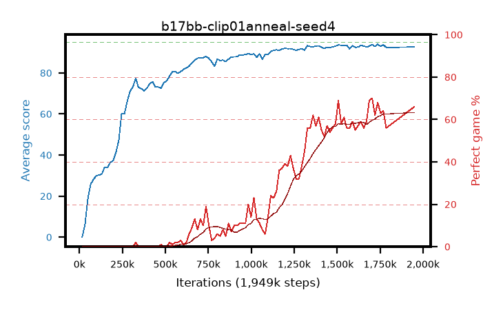

# b17bb-clip01anneal-seed4

step **1,949,696** · 110 evals · trailing **92.92** · peak **92.96** @1,785,856 · sef **0.0** · best30 **59.6** @1,949,696

## Config

| | |
|---|---|
| algo | ppo |
| collect_envs | 128 |
| discount | 0.99 |
| eval_interval | 16384 |
| eval_queue | True |
| eval_queue_depth | 16 |
| eval_workers | 8 |
| fc_layers | (320,) |
| graph_eval_episodes | 100 |
| max_steps | 50003968 |
| min_checkpoint_score | 40.0 |
| ppo_adam_epsilon | 1e-07 |
| ppo_anneal_fraction | 1.0 |
| ppo_clip | 0.1 |
| ppo_clip_final | 0.02 |
| ppo_entropy_coef | 0.01 |
| ppo_entropy_coef_final | None |
| ppo_epochs | 4 |
| ppo_gae_lambda | 0.98 |
| ppo_gradient_clipping | 0.5 |
| ppo_horizon | 33.6 |
| ppo_learning_rate | 0.0003 |
| ppo_learning_rate_final | None |
| ppo_minibatch | 256 |
| ppo_normalize_adv | True |
| ppo_rollout | 128 |
| ppo_target_kl | 0.0 |
| ppo_transitions_per_rollout | 16384 |
| ppo_value_loss | huber |
| ppo_vf_coef | 0.5 |
| seed | 4 |
| torch_threads | 1 |

## Evals

| step | avg score | trailing avg | min score | max score | avg reward | perfect % | epsilon |
|---|---|---|---|---|---|---|---|
| 16384 | 0.04 | 0.04 | 0.0 | 2.0 | -3.049 | 0.0 |  |
| 32768 | 6.24 | 3.14 | 0.0 | 15.0 | 3.242 | 0.0 |  |
| 49152 | 18.7 | 8.33 | 1.0 | 39.0 | 14.19 | 0.0 |  |
| ... | ... | ... | ... | ... | ... | ... | ... |
| 1622016 | 92.59 | 91.61 | 34.0 | 95.0 | 148.216 | 57.0 |  |
| 1638400 | 93.39 | 92.48 | 82.0 | 95.0 | 150.999 | 59.0 |  |
| 1654784 | 93.12 | 92.76 | 78.0 | 95.0 | 147.674 | 56.0 |  |
| 1671168 | 92.69 | 91.31 | 38.0 | 95.0 | 150.323 | 59.0 |  |
| 1687552 | 92.99 | 91.96 | 12.0 | 95.0 | 160.601 | 69.0 |  |
| 1703936 | 93.93 | 92.12 | 82.0 | 95.0 | 162.508 | 70.0 |  |
| 1720320 | 92.88 | 92.25 | 16.0 | 95.0 | 153.416 | 62.0 |  |
| 1736704 | 93.94 | 92.71 | 86.0 | 95.0 | 160.531 | 68.0 |  |
| 1753088 | 92.89 | 92.89 | 18.0 | 95.0 | 154.515 | 63.0 |  |
| 1769472 | 93.69 | 92.64 | 86.0 | 95.0 | 156.289 | 64.0 |  |
| 1785856 | 92.41 | 92.96 | 44.0 | 95.0 | 147.052 | 56.0 |  |
| 1949696 | 92.62 | 92.92 | 32.0 | 95.0 | 157.17 | 66.0 |  |
