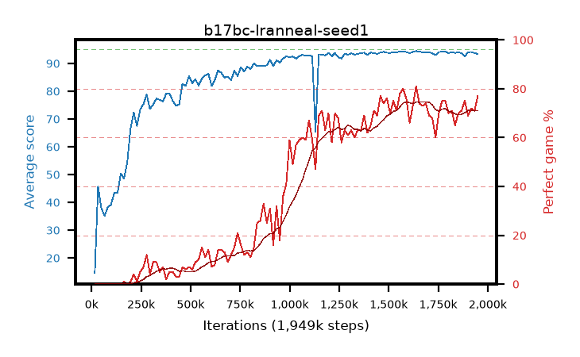

# b17bc-lranneal-seed1

step **1,949,696** · 119 evals · trailing **93.91** · peak **93.93** @1,720,320 · sef **1.7** · best30 **72.3** @1,933,312

## Config

| | |
|---|---|
| algo | ppo |
| collect_envs | 128 |
| discount | 0.99 |
| eval_interval | 16384 |
| eval_queue | True |
| eval_queue_depth | 16 |
| eval_workers | 8 |
| fc_layers | (320,) |
| graph_eval_episodes | 100 |
| max_steps | 50003968 |
| min_checkpoint_score | 40.0 |
| ppo_adam_epsilon | 1e-07 |
| ppo_anneal_fraction | 1.0 |
| ppo_clip | 0.2 |
| ppo_clip_final | None |
| ppo_entropy_coef | 0.01 |
| ppo_entropy_coef_final | None |
| ppo_epochs | 4 |
| ppo_gae_lambda | 0.98 |
| ppo_gradient_clipping | 0.5 |
| ppo_horizon | 33.6 |
| ppo_learning_rate | 0.0003 |
| ppo_learning_rate_final | 0.0 |
| ppo_minibatch | 256 |
| ppo_normalize_adv | True |
| ppo_rollout | 128 |
| ppo_target_kl | 0.0 |
| ppo_transitions_per_rollout | 16384 |
| ppo_value_loss | huber |
| ppo_vf_coef | 0.5 |
| seed | 1 |
| torch_threads | 1 |

## Evals

| step | avg score | trailing avg | min score | max score | avg reward | perfect % | epsilon |
|---|---|---|---|---|---|---|---|
| 16384 | 14.59 | 14.59 | 1.0 | 33.0 | 12.828 | 0.0 |  |
| 32768 | 45.69 | 32.83 | 11.0 | 81.0 | 40.625 | 0.0 |  |
| 49152 | 37.99 | 34.12 | 1.0 | 82.0 | 32.976 | 0.0 |  |
| ... | ... | ... | ... | ... | ... | ... | ... |
| 1769472 | 94.2 | 93.9 | 90.0 | 95.0 | 167.774 | 75.0 |  |
| 1785856 | 94.26 | 93.91 | 90.0 | 95.0 | 167.839 | 75.0 |  |
| 1802240 | 93.74 | 93.62 | 76.0 | 95.0 | 162.329 | 70.0 |  |
| 1818624 | 93.99 | 93.72 | 88.0 | 95.0 | 163.57 | 71.0 |  |
| 1835008 | 93.81 | 93.85 | 86.0 | 95.0 | 157.402 | 65.0 |  |
| 1851392 | 93.99 | 93.78 | 86.0 | 95.0 | 162.589 | 70.0 |  |
| 1867776 | 93.69 | 93.84 | 63.0 | 95.0 | 163.301 | 71.0 |  |
| 1884160 | 92.48 | 93.88 | 29.0 | 95.0 | 166.083 | 75.0 |  |
| 1900544 | 94.05 | 93.93 | 86.0 | 95.0 | 161.642 | 69.0 |  |
| 1916928 | 94.15 | 93.91 | 86.0 | 95.0 | 164.753 | 72.0 |  |
| 1933312 | 93.72 | 93.91 | 60.0 | 95.0 | 163.267 | 71.0 |  |
| 1949696 | 93.42 | 93.91 | 8.0 | 95.0 | 169.0 | 77.0 |  |
