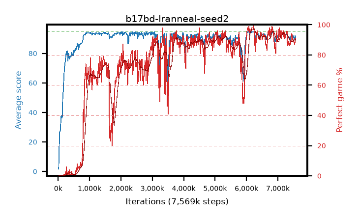

# b17bd-lranneal-seed2

step **7,569,408** · 457 evals · trailing **91.94** · peak **93.56** @1,458,176 · sef **56.9** · best30 **94.4** @6,488,064

## Config

| | |
|---|---|
| algo | ppo |
| collect_envs | 128 |
| discount | 0.99 |
| eval_interval | 16384 |
| eval_queue | True |
| eval_queue_depth | 16 |
| eval_workers | 8 |
| fc_layers | (320,) |
| graph_eval_episodes | 100 |
| max_steps | 50003968 |
| min_checkpoint_score | 40.0 |
| ppo_adam_epsilon | 1e-07 |
| ppo_anneal_fraction | 1.0 |
| ppo_clip | 0.2 |
| ppo_clip_final | None |
| ppo_entropy_coef | 0.01 |
| ppo_entropy_coef_final | None |
| ppo_epochs | 4 |
| ppo_gae_lambda | 0.98 |
| ppo_gradient_clipping | 0.5 |
| ppo_horizon | 33.6 |
| ppo_learning_rate | 0.0003 |
| ppo_learning_rate_final | 0.0 |
| ppo_minibatch | 256 |
| ppo_normalize_adv | True |
| ppo_rollout | 128 |
| ppo_target_kl | 0.0 |
| ppo_transitions_per_rollout | 16384 |
| ppo_value_loss | huber |
| ppo_vf_coef | 0.5 |
| seed | 2 |
| torch_threads | 1 |

## Evals

| step | avg score | trailing avg | min score | max score | avg reward | perfect % | epsilon |
|---|---|---|---|---|---|---|---|
| 16384 | 1.64 | 1.64 | 0.0 | 4.0 | -0.784 | 0.0 |  |
| 32768 | 16.76 | 18.14 | 4.0 | 41.0 | 11.959 | 0.0 |  |
| 49152 | 26.87 | 14.26 | 6.0 | 49.0 | 21.821 | 0.0 |  |
| ... | ... | ... | ... | ... | ... | ... | ... |
| 7356416 | 90.41 | 92.32 | 46.0 | 95.0 | 175.127 | 86.0 |  |
| 7372800 | 90.05 | 92.12 | 39.0 | 95.0 | 174.777 | 86.0 |  |
| 7389184 | 91.4 | 91.92 | 44.0 | 95.0 | 179.109 | 89.0 |  |
| 7405568 | 89.64 | 91.78 | 38.0 | 95.0 | 175.352 | 87.0 |  |
| 7421952 | 91.69 | 91.67 | 55.0 | 95.0 | 180.398 | 90.0 |  |
| 7438336 | 92.8 | 91.74 | 36.0 | 95.0 | 185.459 | 94.0 |  |
| 7454720 | 92.55 | 92.05 | 54.0 | 95.0 | 184.247 | 93.0 |  |
| 7471104 | 91.45 | 91.72 | 43.0 | 95.0 | 180.153 | 90.0 |  |
| 7487488 | 91.73 | 91.98 | 53.0 | 95.0 | 180.43 | 90.0 |  |
| 7536640 | 89.56 | 91.61 | 33.0 | 95.0 | 175.278 | 87.0 |  |
| 7553024 | 91.89 | 91.8 | 53.0 | 95.0 | 181.575 | 91.0 |  |
| 7569408 | 90.41 | 91.94 | 37.0 | 95.0 | 180.1 | 91.0 |  |
