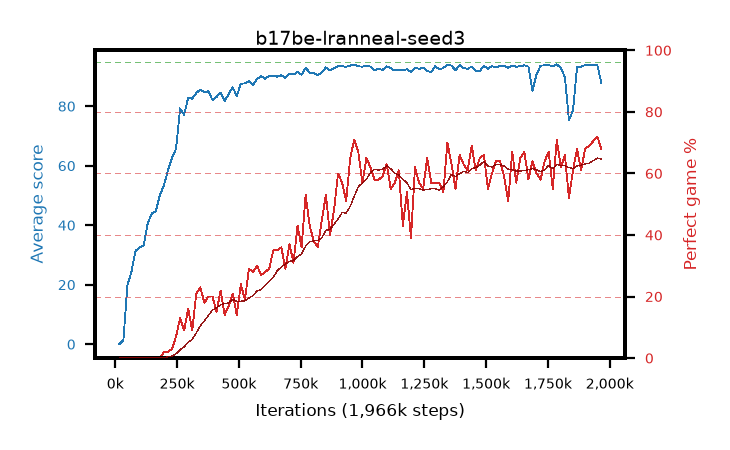

# b17be-lranneal-seed3

step **1,966,080** · 119 evals · trailing **91.64** · peak **92.97** @1,753,088 · sef **0.0** · best30 **62.8** @1,966,080

## Config

| | |
|---|---|
| algo | ppo |
| collect_envs | 128 |
| discount | 0.99 |
| eval_interval | 16384 |
| eval_queue | True |
| eval_queue_depth | 16 |
| eval_workers | 8 |
| fc_layers | (320,) |
| graph_eval_episodes | 100 |
| max_steps | 50003968 |
| min_checkpoint_score | 40.0 |
| ppo_adam_epsilon | 1e-07 |
| ppo_anneal_fraction | 1.0 |
| ppo_clip | 0.2 |
| ppo_clip_final | None |
| ppo_entropy_coef | 0.01 |
| ppo_entropy_coef_final | None |
| ppo_epochs | 4 |
| ppo_gae_lambda | 0.98 |
| ppo_gradient_clipping | 0.5 |
| ppo_horizon | 33.6 |
| ppo_learning_rate | 0.0003 |
| ppo_learning_rate_final | 0.0 |
| ppo_minibatch | 256 |
| ppo_normalize_adv | True |
| ppo_rollout | 128 |
| ppo_target_kl | 0.0 |
| ppo_transitions_per_rollout | 16384 |
| ppo_value_loss | huber |
| ppo_vf_coef | 0.5 |
| seed | 3 |
| torch_threads | 1 |

## Evals

| step | avg score | trailing avg | min score | max score | avg reward | perfect % | epsilon |
|---|---|---|---|---|---|---|---|
| 16384 | 0.03 | 0.03 | 0.0 | 1.0 | -3.548 | 0.0 |  |
| 32768 | 1.35 | 0.69 | 0.0 | 13.0 | 0.661 | 0.0 |  |
| 49152 | 19.79 | 15.39 | 0.0 | 43.0 | 14.953 | 0.0 |  |
| ... | ... | ... | ... | ... | ... | ... | ... |
| 1769472 | 93.38 | 91.74 | 82.0 | 95.0 | 147.021 | 55.0 |  |
| 1785856 | 94.09 | 91.75 | 86.0 | 95.0 | 163.7 | 71.0 |  |
| 1802240 | 92.83 | 91.76 | 10.0 | 95.0 | 153.479 | 62.0 |  |
| 1818624 | 89.82 | 92.86 | 27.0 | 95.0 | 154.459 | 66.0 |  |
| 1835008 | 75.42 | 92.4 | 19.0 | 95.0 | 126.202 | 52.0 |  |
| 1851392 | 78.54 | 91.99 | 20.0 | 95.0 | 138.263 | 61.0 |  |
| 1867776 | 93.05 | 92.48 | 29.0 | 95.0 | 159.603 | 68.0 |  |
| 1884160 | 93.3 | 92.02 | 52.0 | 95.0 | 152.95 | 61.0 |  |
| 1900544 | 93.83 | 91.81 | 86.0 | 95.0 | 160.428 | 68.0 |  |
| 1916928 | 93.87 | 91.78 | 84.0 | 95.0 | 161.449 | 69.0 |  |
| 1949696 | 93.96 | 91.75 | 78.0 | 95.0 | 164.564 | 72.0 |  |
| 1966080 | 87.76 | 91.64 | 25.0 | 95.0 | 154.459 | 68.0 |  |
