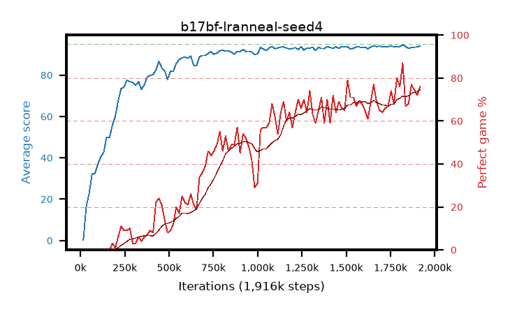

# b17bf-lranneal-seed4

step **1,916,928** · 116 evals · trailing **93.62** · peak **93.63** @1,785,856 · sef **1.7** · best30 **70.3** @1,916,928

## Config

| | |
|---|---|
| algo | ppo |
| collect_envs | 128 |
| discount | 0.99 |
| eval_interval | 16384 |
| eval_queue | True |
| eval_queue_depth | 16 |
| eval_workers | 8 |
| fc_layers | (320,) |
| graph_eval_episodes | 100 |
| max_steps | 50003968 |
| min_checkpoint_score | 40.0 |
| ppo_adam_epsilon | 1e-07 |
| ppo_anneal_fraction | 1.0 |
| ppo_clip | 0.2 |
| ppo_clip_final | None |
| ppo_entropy_coef | 0.01 |
| ppo_entropy_coef_final | None |
| ppo_epochs | 4 |
| ppo_gae_lambda | 0.98 |
| ppo_gradient_clipping | 0.5 |
| ppo_horizon | 33.6 |
| ppo_learning_rate | 0.0003 |
| ppo_learning_rate_final | 0.0 |
| ppo_minibatch | 256 |
| ppo_normalize_adv | True |
| ppo_rollout | 128 |
| ppo_target_kl | 0.0 |
| ppo_transitions_per_rollout | 16384 |
| ppo_value_loss | huber |
| ppo_vf_coef | 0.5 |
| seed | 4 |
| torch_threads | 1 |

## Evals

| step | avg score | trailing avg | min score | max score | avg reward | perfect % | epsilon |
|---|---|---|---|---|---|---|---|
| 16384 | 0.2 | 0.2 | 0.0 | 1.0 | -0.483 | 0.0 |  |
| 32768 | 16.47 | 8.33 | 1.0 | 32.0 | 12.098 | 0.0 |  |
| 49152 | 22.79 | 13.15 | 5.0 | 45.0 | 17.755 | 0.0 |  |
| ... | ... | ... | ... | ... | ... | ... | ... |
| 1720320 | 93.82 | 93.22 | 84.0 | 95.0 | 158.426 | 66.0 |  |
| 1736704 | 93.83 | 93.29 | 84.0 | 95.0 | 159.417 | 67.0 |  |
| 1753088 | 94.1 | 93.44 | 84.0 | 95.0 | 166.682 | 74.0 |  |
| 1769472 | 93.79 | 93.55 | 84.0 | 95.0 | 160.423 | 68.0 |  |
| 1785856 | 93.62 | 93.63 | 20.0 | 95.0 | 172.199 | 80.0 |  |
| 1802240 | 93.82 | 93.23 | 70.0 | 95.0 | 168.427 | 76.0 |  |
| 1818624 | 94.66 | 93.26 | 92.0 | 95.0 | 180.238 | 87.0 |  |
| 1835008 | 93.85 | 93.34 | 88.0 | 95.0 | 159.438 | 67.0 |  |
| 1851392 | 92.9 | 93.44 | 2.0 | 95.0 | 159.554 | 68.0 |  |
| 1867776 | 93.4 | 93.58 | 16.0 | 95.0 | 168.994 | 77.0 |  |
| 1900544 | 93.67 | 93.38 | 74.0 | 95.0 | 164.235 | 72.0 |  |
| 1916928 | 94.11 | 93.62 | 86.0 | 95.0 | 168.682 | 76.0 |  |
