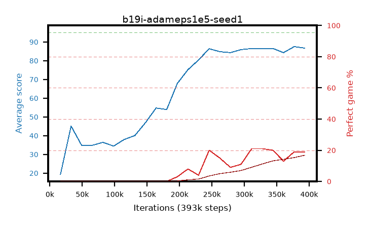

# b19i-adameps1e5-seed1

step **393,216** · 24 evals · trailing **63.39** · peak **63.39** @393,216 · sef **0.0** · best30 **0.0** @393,216

## Config

| | |
|---|---|
| algo | ppo |
| collect_envs | 128 |
| discount | 0.99 |
| eval_interval | 16384 |
| eval_queue | True |
| eval_queue_depth | 16 |
| eval_workers | 8 |
| fc_layers | (320,) |
| graph_eval_episodes | 100 |
| max_steps | 50003968 |
| min_checkpoint_score | 40.0 |
| ppo_adam_epsilon | 1e-05 |
| ppo_anneal_fraction | 1.0 |
| ppo_clip | 0.2 |
| ppo_clip_final | None |
| ppo_entropy_coef | 0.01 |
| ppo_entropy_coef_final | None |
| ppo_epochs | 4 |
| ppo_gae_lambda | 0.98 |
| ppo_gradient_clipping | 0.5 |
| ppo_horizon | 33.6 |
| ppo_learning_rate | 0.0003 |
| ppo_learning_rate_final | None |
| ppo_minibatch | 256 |
| ppo_normalize_adv | True |
| ppo_rollout | 128 |
| ppo_target_kl | 0.0 |
| ppo_transitions_per_rollout | 16384 |
| ppo_value_loss | huber |
| ppo_vf_coef | 0.5 |
| seed | 1 |
| torch_threads | 1 |

## Evals

| step | avg score | trailing avg | min score | max score | avg reward | perfect % | epsilon |
|---|---|---|---|---|---|---|---|
| 16384 | 19.35 | 30.84 | 1.0 | 39.0 | 16.137 | 0.0 |  |
| 32768 | 45.1 | 34.69 | 5.0 | 84.0 | 40.128 | 0.0 |  |
| 49152 | 34.75 | 34.75 | 10.0 | 70.0 | 29.673 | 0.0 |  |
| ... | ... | ... | ... | ... | ... | ... | ... |
| 212992 | 75.2 | 41.8 | 9.0 | 95.0 | 79.676 | 8.0 |  |
| 229376 | 80.4 | 50.9 | 36.0 | 95.0 | 81.885 | 4.0 |  |
| 245760 | 86.41 | 61.23 | 52.0 | 95.0 | 104.446 | 20.0 |  |
| 262144 | 84.8 | 59.64 | 5.0 | 95.0 | 98.495 | 15.0 |  |
| 278528 | 84.31 | 53.13 | 9.0 | 95.0 | 91.999 | 9.0 |  |
| 294912 | 85.92 | 48.63 | 64.0 | 95.0 | 95.562 | 11.0 |  |
| 311296 | 86.49 | 45.52 | 60.0 | 95.0 | 106.189 | 21.0 |  |
| 327680 | 86.43 | 55.13 | 29.0 | 95.0 | 106.099 | 21.0 |  |
| 344064 | 86.53 | 56.88 | 2.0 | 95.0 | 105.195 | 20.0 |  |
| 360448 | 84.29 | 58.32 | 33.0 | 95.0 | 95.976 | 13.0 |  |
| 376832 | 87.5 | 62.38 | 60.0 | 95.0 | 105.157 | 19.0 |  |
| 393216 | 86.72 | 63.39 | 58.0 | 95.0 | 104.374 | 19.0 |  |
