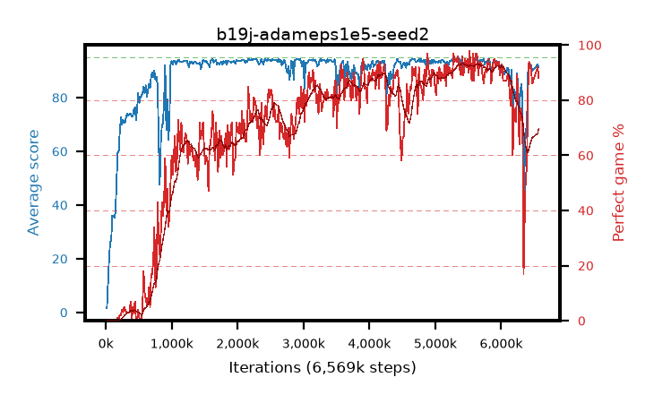

# b19j-adameps1e5-seed2

step **6,569,984** · 396 evals · trailing **82.61** · peak **93.87** @2,621,440 · sef **47.0** · best30 **92.8** @5,685,248

## Config

| | |
|---|---|
| algo | ppo |
| collect_envs | 128 |
| discount | 0.99 |
| eval_interval | 16384 |
| eval_queue | True |
| eval_queue_depth | 16 |
| eval_workers | 8 |
| fc_layers | (320,) |
| graph_eval_episodes | 100 |
| max_steps | 50003968 |
| min_checkpoint_score | 40.0 |
| ppo_adam_epsilon | 1e-05 |
| ppo_anneal_fraction | 1.0 |
| ppo_clip | 0.2 |
| ppo_clip_final | None |
| ppo_entropy_coef | 0.01 |
| ppo_entropy_coef_final | None |
| ppo_epochs | 4 |
| ppo_gae_lambda | 0.98 |
| ppo_gradient_clipping | 0.5 |
| ppo_horizon | 33.6 |
| ppo_learning_rate | 0.0003 |
| ppo_learning_rate_final | None |
| ppo_minibatch | 256 |
| ppo_normalize_adv | True |
| ppo_rollout | 128 |
| ppo_target_kl | 0.0 |
| ppo_transitions_per_rollout | 16384 |
| ppo_value_loss | huber |
| ppo_vf_coef | 0.5 |
| seed | 2 |
| torch_threads | 1 |

## Evals

| step | avg score | trailing avg | min score | max score | avg reward | perfect % | epsilon |
|---|---|---|---|---|---|---|---|
| 16384 | 1.58 | 1.58 | 0.0 | 5.0 | -0.578 | 0.0 |  |
| 32768 | 10.67 | 6.12 | 0.0 | 22.0 | 6.676 | 0.0 |  |
| 49152 | 19.41 | 10.55 | 7.0 | 44.0 | 14.513 | 0.0 |  |
| ... | ... | ... | ... | ... | ... | ... | ... |
| 6307840 | 84.91 | 85.7 | 31.0 | 95.0 | 160.653 | 77.0 |  |
| 6324224 | 79.69 | 90.37 | 27.0 | 95.0 | 149.452 | 71.0 |  |
| 6340608 | 41.21 | 88.14 | 21.0 | 95.0 | 57.341 | 17.0 |  |
| 6356992 | 55.43 | 86.01 | 20.0 | 95.0 | 91.422 | 37.0 |  |
| 6373376 | 67.61 | 84.85 | 24.0 | 95.0 | 119.487 | 53.0 |  |
| 6389760 | 69.55 | 83.75 | 26.0 | 95.0 | 123.413 | 55.0 |  |
| 6406144 | 89.08 | 84.55 | 28.0 | 95.0 | 170.785 | 83.0 |  |
| 6422528 | 93.02 | 82.64 | 20.0 | 95.0 | 185.688 | 94.0 |  |
| 6455296 | 92.11 | 82.6 | 53.0 | 95.0 | 181.787 | 91.0 |  |
| 6471680 | 89.91 | 83.17 | 49.0 | 95.0 | 174.626 | 86.0 |  |
| 6553600 | 92.26 | 82.65 | 43.0 | 95.0 | 182.954 | 92.0 |  |
| 6569984 | 91.53 | 82.61 | 49.0 | 95.0 | 178.23 | 88.0 |  |
