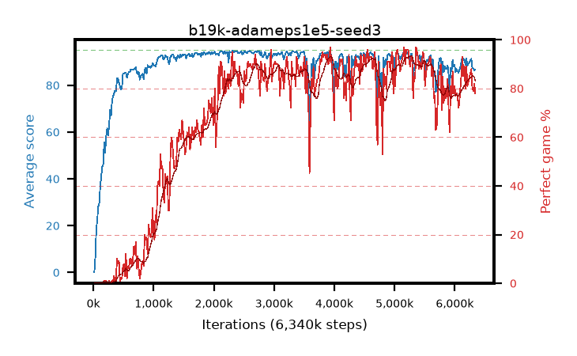

# b19k-adameps1e5-seed3

step **6,340,608** · 384 evals · trailing **87.68** · peak **94.17** @2,768,896 · sef **54.4** · best30 **91.2** @5,488,640

## Config

| | |
|---|---|
| algo | ppo |
| collect_envs | 128 |
| discount | 0.99 |
| eval_interval | 16384 |
| eval_queue | True |
| eval_queue_depth | 16 |
| eval_workers | 8 |
| fc_layers | (320,) |
| graph_eval_episodes | 100 |
| max_steps | 50003968 |
| min_checkpoint_score | 40.0 |
| ppo_adam_epsilon | 1e-05 |
| ppo_anneal_fraction | 1.0 |
| ppo_clip | 0.2 |
| ppo_clip_final | None |
| ppo_entropy_coef | 0.01 |
| ppo_entropy_coef_final | None |
| ppo_epochs | 4 |
| ppo_gae_lambda | 0.98 |
| ppo_gradient_clipping | 0.5 |
| ppo_horizon | 33.6 |
| ppo_learning_rate | 0.0003 |
| ppo_learning_rate_final | None |
| ppo_minibatch | 256 |
| ppo_normalize_adv | True |
| ppo_rollout | 128 |
| ppo_target_kl | 0.0 |
| ppo_transitions_per_rollout | 16384 |
| ppo_value_loss | huber |
| ppo_vf_coef | 0.5 |
| seed | 3 |
| torch_threads | 1 |

## Evals

| step | avg score | trailing avg | min score | max score | avg reward | perfect % | epsilon |
|---|---|---|---|---|---|---|---|
| 16384 | 0.1 | 0.1 | 0.0 | 1.0 | -3.522 | 0.0 |  |
| 32768 | 6.35 | 3.22 | 0.0 | 21.0 | 4.831 | 0.0 |  |
| 49152 | 18.25 | 8.23 | 0.0 | 35.0 | 13.675 | 0.0 |  |
| ... | ... | ... | ... | ... | ... | ... | ... |
| 6111232 | 90.49 | 86.57 | 41.0 | 95.0 | 175.186 | 86.0 |  |
| 6127616 | 92.31 | 87.15 | 41.0 | 95.0 | 183.988 | 93.0 |  |
| 6144000 | 90.59 | 86.78 | 43.0 | 95.0 | 174.249 | 85.0 |  |
| 6160384 | 91.0 | 86.57 | 14.0 | 95.0 | 178.692 | 89.0 |  |
| 6176768 | 88.82 | 86.88 | 44.0 | 95.0 | 167.549 | 80.0 |  |
| 6193152 | 91.45 | 87.8 | 44.0 | 95.0 | 179.143 | 89.0 |  |
| 6209536 | 88.39 | 87.77 | 24.0 | 95.0 | 168.114 | 81.0 |  |
| 6275072 | 91.36 | 87.71 | 51.0 | 95.0 | 178.044 | 88.0 |  |
| 6291456 | 87.44 | 87.81 | 41.0 | 95.0 | 166.155 | 80.0 |  |
| 6307840 | 87.22 | 87.63 | 37.0 | 95.0 | 164.926 | 79.0 |  |
| 6324224 | 86.47 | 87.46 | 25.0 | 95.0 | 167.185 | 82.0 |  |
| 6340608 | 86.59 | 87.68 | 29.0 | 95.0 | 163.313 | 78.0 |  |
