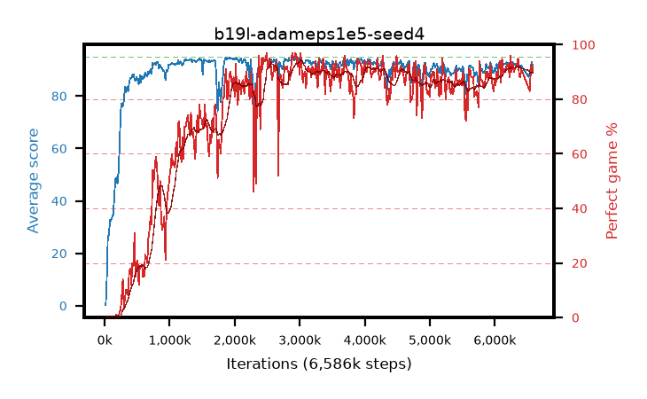

# b19l-adameps1e5-seed4

step **6,586,368** · 396 evals · trailing **91.58** · peak **93.61** @3,227,648 · sef **68.4** · best30 **91.4** @3,244,032

## Config

| | |
|---|---|
| algo | ppo |
| collect_envs | 128 |
| discount | 0.99 |
| eval_interval | 16384 |
| eval_queue | True |
| eval_queue_depth | 16 |
| eval_workers | 8 |
| fc_layers | (320,) |
| graph_eval_episodes | 100 |
| max_steps | 50003968 |
| min_checkpoint_score | 40.0 |
| ppo_adam_epsilon | 1e-05 |
| ppo_anneal_fraction | 1.0 |
| ppo_clip | 0.2 |
| ppo_clip_final | None |
| ppo_entropy_coef | 0.01 |
| ppo_entropy_coef_final | None |
| ppo_epochs | 4 |
| ppo_gae_lambda | 0.98 |
| ppo_gradient_clipping | 0.5 |
| ppo_horizon | 33.6 |
| ppo_learning_rate | 0.0003 |
| ppo_learning_rate_final | None |
| ppo_minibatch | 256 |
| ppo_normalize_adv | True |
| ppo_rollout | 128 |
| ppo_target_kl | 0.0 |
| ppo_transitions_per_rollout | 16384 |
| ppo_value_loss | huber |
| ppo_vf_coef | 0.5 |
| seed | 4 |
| torch_threads | 1 |

## Evals

| step | avg score | trailing avg | min score | max score | avg reward | perfect % | epsilon |
|---|---|---|---|---|---|---|---|
| 16384 | 0.24 | 0.24 | 0.0 | 2.0 | -0.576 | 0.0 |  |
| 32768 | 10.3 | 19.36 | 0.0 | 28.0 | 7.048 | 0.0 |  |
| 49152 | 26.65 | 18.0 | 5.0 | 46.0 | 21.607 | 0.0 |  |
| ... | ... | ... | ... | ... | ... | ... | ... |
| 6307840 | 91.82 | 91.44 | 53.0 | 95.0 | 181.53 | 91.0 |  |
| 6324224 | 92.34 | 91.54 | 54.0 | 95.0 | 183.041 | 92.0 |  |
| 6340608 | 92.32 | 90.54 | 44.0 | 95.0 | 183.992 | 93.0 |  |
| 6356992 | 93.16 | 91.38 | 50.0 | 95.0 | 186.837 | 95.0 |  |
| 6373376 | 91.49 | 91.76 | 44.0 | 95.0 | 179.179 | 89.0 |  |
| 6389760 | 90.74 | 91.6 | 28.0 | 95.0 | 177.438 | 88.0 |  |
| 6406144 | 91.53 | 91.78 | 28.0 | 95.0 | 181.233 | 91.0 |  |
| 6520832 | 87.3 | 91.67 | 29.0 | 95.0 | 170.025 | 84.0 |  |
| 6537216 | 88.69 | 91.5 | 43.0 | 95.0 | 170.41 | 83.0 |  |
| 6553600 | 91.33 | 91.73 | 16.0 | 95.0 | 181.027 | 91.0 |  |
| 6569984 | 92.9 | 91.72 | 30.0 | 95.0 | 184.594 | 93.0 |  |
| 6586368 | 91.08 | 91.58 | 30.0 | 95.0 | 179.787 | 90.0 |  |
