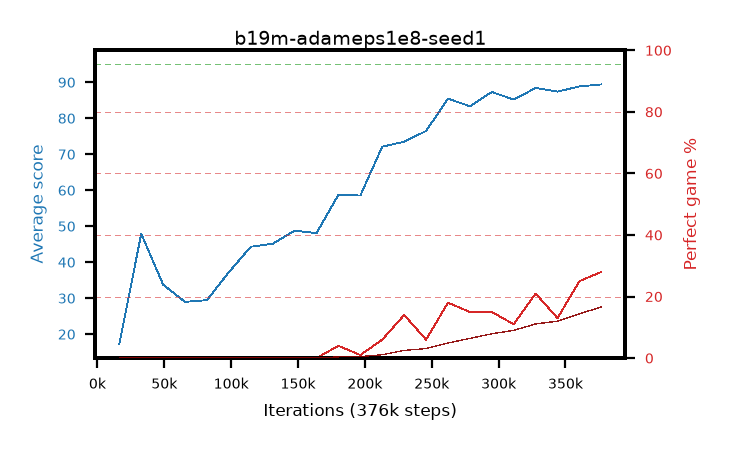

# b19m-adameps1e8-seed1

step **376,832** · 23 evals · trailing **58.91** · peak **61.55** @245,760 · sef **0.0** · best30 **0.0** @376,832

## Config

| | |
|---|---|
| algo | ppo |
| collect_envs | 128 |
| discount | 0.99 |
| eval_interval | 16384 |
| eval_queue | True |
| eval_queue_depth | 16 |
| eval_workers | 8 |
| fc_layers | (320,) |
| graph_eval_episodes | 100 |
| max_steps | 50003968 |
| min_checkpoint_score | 40.0 |
| ppo_adam_epsilon | 1e-08 |
| ppo_anneal_fraction | 1.0 |
| ppo_clip | 0.2 |
| ppo_clip_final | None |
| ppo_entropy_coef | 0.01 |
| ppo_entropy_coef_final | None |
| ppo_epochs | 4 |
| ppo_gae_lambda | 0.98 |
| ppo_gradient_clipping | 0.5 |
| ppo_horizon | 33.6 |
| ppo_learning_rate | 0.0003 |
| ppo_learning_rate_final | None |
| ppo_minibatch | 256 |
| ppo_normalize_adv | True |
| ppo_rollout | 128 |
| ppo_target_kl | 0.0 |
| ppo_transitions_per_rollout | 16384 |
| ppo_value_loss | huber |
| ppo_vf_coef | 0.5 |
| seed | 1 |
| torch_threads | 1 |

## Evals

| step | avg score | trailing avg | min score | max score | avg reward | perfect % | epsilon |
|---|---|---|---|---|---|---|---|
| 16384 | 17.24 | 26.66 | 3.0 | 40.0 | 15.522 | 0.0 |  |
| 32768 | 47.92 | 34.13 | 12.0 | 91.0 | 42.908 | 0.0 |  |
| 49152 | 33.76 | 31.37 | 6.0 | 57.0 | 28.735 | 0.0 |  |
| ... | ... | ... | ... | ... | ... | ... | ... |
| 196608 | 58.53 | 39.13 | 19.0 | 95.0 | 54.546 | 1.0 |  |
| 212992 | 72.11 | 55.86 | 8.0 | 95.0 | 74.646 | 6.0 |  |
| 229376 | 73.49 | 60.87 | 3.0 | 95.0 | 84.824 | 14.0 |  |
| 245760 | 76.47 | 61.55 | 30.0 | 95.0 | 79.117 | 6.0 |  |
| 262144 | 85.45 | 49.95 | 32.0 | 95.0 | 100.916 | 18.0 |  |
| 278528 | 83.35 | 57.31 | 32.0 | 95.0 | 96.161 | 15.0 |  |
| 294912 | 87.3 | 43.51 | 13.0 | 95.0 | 100.98 | 15.0 |  |
| 311296 | 85.21 | 46.99 | 44.0 | 95.0 | 94.965 | 11.0 |  |
| 327680 | 88.42 | 52.79 | 66.0 | 95.0 | 108.085 | 21.0 |  |
| 344064 | 87.42 | 60.27 | 40.0 | 95.0 | 99.118 | 13.0 |  |
| 360448 | 88.85 | 54.91 | 50.0 | 95.0 | 112.523 | 25.0 |  |
| 376832 | 89.41 | 58.91 | 30.0 | 95.0 | 116.06 | 28.0 |  |
