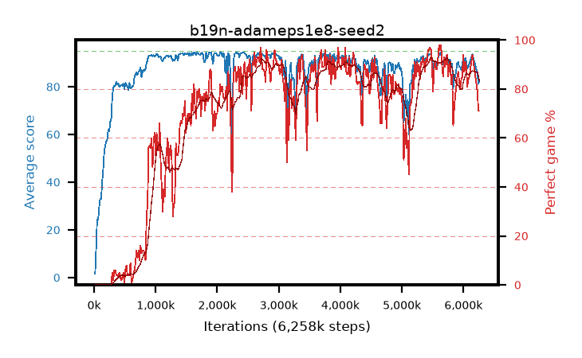

# b19n-adameps1e8-seed2

step **6,258,688** · 376 evals · trailing **89.02** · peak **93.59** @1,703,936 · sef **52.4** · best30 **91.2** @5,783,552

## Config

| | |
|---|---|
| algo | ppo |
| collect_envs | 128 |
| discount | 0.99 |
| eval_interval | 16384 |
| eval_queue | True |
| eval_queue_depth | 16 |
| eval_workers | 8 |
| fc_layers | (320,) |
| graph_eval_episodes | 100 |
| max_steps | 50003968 |
| min_checkpoint_score | 40.0 |
| ppo_adam_epsilon | 1e-08 |
| ppo_anneal_fraction | 1.0 |
| ppo_clip | 0.2 |
| ppo_clip_final | None |
| ppo_entropy_coef | 0.01 |
| ppo_entropy_coef_final | None |
| ppo_epochs | 4 |
| ppo_gae_lambda | 0.98 |
| ppo_gradient_clipping | 0.5 |
| ppo_horizon | 33.6 |
| ppo_learning_rate | 0.0003 |
| ppo_learning_rate_final | None |
| ppo_minibatch | 256 |
| ppo_normalize_adv | True |
| ppo_rollout | 128 |
| ppo_target_kl | 0.0 |
| ppo_transitions_per_rollout | 16384 |
| ppo_value_loss | huber |
| ppo_vf_coef | 0.5 |
| seed | 2 |
| torch_threads | 1 |

## Evals

| step | avg score | trailing avg | min score | max score | avg reward | perfect % | epsilon |
|---|---|---|---|---|---|---|---|
| 16384 | 1.58 | 1.58 | 0.0 | 6.0 | -0.669 | 0.0 |  |
| 32768 | 12.29 | 6.93 | 0.0 | 25.0 | 7.387 | 0.0 |  |
| 49152 | 24.37 | 20.82 | 5.0 | 76.0 | 19.325 | 0.0 |  |
| ... | ... | ... | ... | ... | ... | ... | ... |
| 5980160 | 89.1 | 89.54 | 41.0 | 95.0 | 172.802 | 85.0 |  |
| 5996544 | 92.36 | 90.61 | 41.0 | 95.0 | 185.039 | 94.0 |  |
| 6012928 | 90.49 | 90.55 | 44.0 | 95.0 | 176.184 | 87.0 |  |
| 6029312 | 92.0 | 90.49 | 37.0 | 95.0 | 181.693 | 91.0 |  |
| 6045696 | 90.57 | 89.89 | 6.0 | 95.0 | 178.283 | 89.0 |  |
| 6062080 | 87.67 | 89.64 | 12.0 | 95.0 | 167.404 | 81.0 |  |
| 6078464 | 88.41 | 89.64 | 43.0 | 95.0 | 171.105 | 84.0 |  |
| 6094848 | 89.81 | 89.41 | 41.0 | 95.0 | 173.508 | 85.0 |  |
| 6144000 | 93.72 | 89.53 | 56.0 | 95.0 | 186.414 | 94.0 |  |
| 6225920 | 85.51 | 88.85 | 29.0 | 95.0 | 163.222 | 79.0 |  |
| 6242304 | 81.32 | 88.59 | 29.0 | 95.0 | 151.079 | 71.0 |  |
| 6258688 | 82.54 | 89.02 | 37.0 | 95.0 | 152.28 | 71.0 |  |
