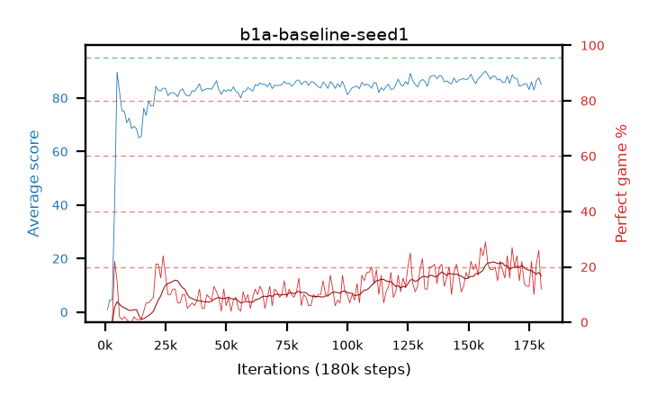

# b1a-baseline-seed1

step **180,000** · 180 evals · trailing **86.71** · peak **87.38** @163,000 · sef **0.0** · best30 **19.8** @179,000

## Config

| | |
|---|---|
| adam_epsilon | 1e-07 |
| algo | dqn |
| batch_size | 128 |
| beta_anneal_steps | 300000 |
| collect_envs | 1 |
| discount | 0.99 |
| eval_interval | 1000 |
| fc_layers | (320,) |
| fork_branches | 4 |
| fork_max_steps | 60 |
| fork_min_length | 85 |
| fork_prob | 0.5 |
| gradient_clipping | 0.0 |
| graph_eval_episodes | 100 |
| guided_fraction | 0.8 |
| initial_collect_steps | 2000 |
| initial_epsilon | 0.4 |
| is_beta | 0.4 |
| is_beta_final | 1.0 |
| is_weights | True |
| learning_rate | 1e-05 |
| max_steps | 3000000 |
| min_checkpoint_score | 40.0 |
| min_epsilon | 0.002 |
| n_step_update | 1 |
| priority_exponent | 0.6 |
| replay_buffer_max_length | 100000 |
| replay_ratio | 1.0 |
| seed | 1 |
| target_update_period | 8 |
| target_update_tau | 1.0 |
| torch_threads | 1 |

## Evals

| step | avg score | trailing avg | min score | max score | avg reward | perfect % | epsilon |
|---|---|---|---|---|---|---|---|
| 1000 | 0.88 | 0.88 | 0.0 | 5.0 | 0.326 | 0.0 | 0.4 |
| 2000 | 4.49 | 2.69 | 1.0 | 22.0 | 3.918 | 0.0 | 0.2 |
| 3000 | 4.57 | 3.31 | 0.0 | 21.0 | 3.996 | 0.0 | 0.2 |
| ... | ... | ... | ... | ... | ... | ... | ... |
| 169000 | 87.38 | 87.15 | 56.0 | 95.0 | 105.915 | 20.0 | 0.00809 |
| 170000 | 87.36 | 87.2 | 54.0 | 95.0 | 109.907 | 24.0 | 0.00802 |
| 171000 | 84.45 | 87.13 | 42.0 | 95.0 | 98.017 | 15.0 | 0.00803 |
| 172000 | 84.69 | 87.1 | 32.0 | 95.0 | 105.257 | 22.0 | 0.00802 |
| 173000 | 85.29 | 87.1 | 53.0 | 95.0 | 97.889 | 14.0 | 0.00799 |
| 174000 | 85.34 | 87.03 | 49.0 | 95.0 | 96.927 | 13.0 | 0.00802 |
| 175000 | 83.14 | 86.94 | 15.0 | 95.0 | 94.781 | 13.0 | 0.00807 |
| 176000 | 86.04 | 86.92 | 19.0 | 95.0 | 106.593 | 22.0 | 0.00804 |
| 177000 | 82.96 | 86.78 | 49.0 | 95.0 | 91.613 | 10.0 | 0.00805 |
| 178000 | 86.47 | 86.75 | 45.0 | 95.0 | 106.066 | 21.0 | 0.008 |
| 179000 | 87.61 | 86.78 | 57.0 | 95.0 | 112.158 | 26.0 | 0.00795 |
| 180000 | 85.08 | 86.71 | 57.0 | 95.0 | 95.657 | 12.0 | 0.00797 |
