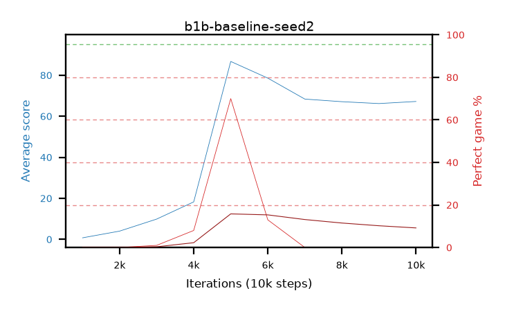

# b1b-baseline-seed2

step **10,000** · 10 evals · trailing **46.7** · peak **46.7** @10,000 · sef **0.0** · best30 **0.0** @10,000

## Config

| | |
|---|---|
| adam_epsilon | 1e-07 |
| algo | dqn |
| batch_size | 128 |
| beta_anneal_steps | 300000 |
| collect_envs | 1 |
| discount | 0.99 |
| eval_interval | 1000 |
| fc_layers | (320,) |
| fork_branches | 4 |
| fork_max_steps | 60 |
| fork_min_length | 85 |
| fork_prob | 0.5 |
| gradient_clipping | 0.0 |
| graph_eval_episodes | 100 |
| guided_fraction | 0.8 |
| initial_collect_steps | 2000 |
| initial_epsilon | 0.4 |
| is_beta | 0.4 |
| is_beta_final | 1.0 |
| is_weights | True |
| learning_rate | 1e-05 |
| max_steps | 3000000 |
| min_checkpoint_score | 40.0 |
| min_epsilon | 0.002 |
| n_step_update | 1 |
| priority_exponent | 0.6 |
| replay_buffer_max_length | 100000 |
| replay_ratio | 1.0 |
| seed | 2 |
| target_update_period | 8 |
| target_update_tau | 1.0 |
| torch_threads | 1 |

## Evals

| step | avg score | trailing avg | min score | max score | avg reward | perfect % | epsilon |
|---|---|---|---|---|---|---|---|
| 1000 | 0.74 | 0.74 | 0.0 | 3.0 | 0.187 | 0.0 | 0.4 |
| 2000 | 4.01 | 2.38 | 0.0 | 15.0 | 3.445 | 0.0 | 0.4 |
| 3000 | 9.87 | 4.87 | 1.0 | 95.0 | 10.233 | 1.0 | 0.2 |
| 4000 | 18.25 | 8.22 | 1.0 | 95.0 | 25.508 | 8.0 | 0.1 |
| 5000 | 86.71 | 23.92 | 6.0 | 95.0 | 155.218 | 70.0 | 0.0087 |
| 6000 | 78.59 | 33.03 | 4.0 | 95.0 | 90.256 | 13.0 | 0.0088 |
| 7000 | 68.37 | 38.08 | 3.0 | 93.0 | 67.151 | 0.0 | 0.00925 |
| 8000 | 67.1 | 41.7 | 3.0 | 86.0 | 65.894 | 0.0 | 0.00961 |
| 9000 | 66.19 | 44.43 | 2.0 | 89.0 | 65.039 | 0.0 | 0.00989 |
| 10000 | 67.21 | 46.7 | 5.0 | 93.0 | 66.062 | 0.0 | 0.01012 |
