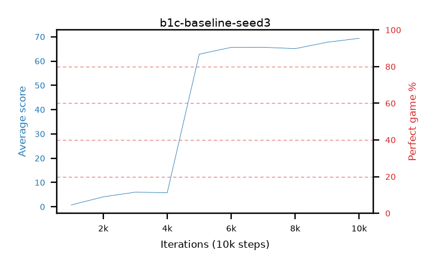

# b1c-baseline-seed3

step **10,000** · 10 evals · trailing **41.3** · peak **41.3** @10,000 · sef **0.0** · best30 **0.0** @10,000

## Config

| | |
|---|---|
| adam_epsilon | 1e-07 |
| algo | dqn |
| batch_size | 128 |
| beta_anneal_steps | 300000 |
| collect_envs | 1 |
| discount | 0.99 |
| eval_interval | 1000 |
| fc_layers | (320,) |
| fork_branches | 4 |
| fork_max_steps | 60 |
| fork_min_length | 85 |
| fork_prob | 0.5 |
| gradient_clipping | 0.0 |
| graph_eval_episodes | 100 |
| guided_fraction | 0.8 |
| initial_collect_steps | 2000 |
| initial_epsilon | 0.4 |
| is_beta | 0.4 |
| is_beta_final | 1.0 |
| is_weights | True |
| learning_rate | 1e-05 |
| max_steps | 3000000 |
| min_checkpoint_score | 40.0 |
| min_epsilon | 0.002 |
| n_step_update | 1 |
| priority_exponent | 0.6 |
| replay_buffer_max_length | 100000 |
| replay_ratio | 1.0 |
| seed | 3 |
| target_update_period | 8 |
| target_update_tau | 1.0 |
| torch_threads | 1 |

## Evals

| step | avg score | trailing avg | min score | max score | avg reward | perfect % | epsilon |
|---|---|---|---|---|---|---|---|
| 1000 | 0.75 | 0.75 | 0.0 | 6.0 | 0.197 | 0.0 | 0.4 |
| 2000 | 4.07 | 2.41 | 0.0 | 20.0 | 3.503 | 0.0 | 0.4 |
| 3000 | 6.0 | 3.61 | 1.0 | 20.0 | 5.425 | 0.0 | 0.2 |
| 4000 | 5.79 | 4.15 | 1.0 | 20.0 | 5.214 | 0.0 | 0.2 |
| 5000 | 62.82 | 15.89 | 15.0 | 84.0 | 61.692 | 0.0 | 0.025 |
| 6000 | 65.65 | 24.18 | 20.0 | 88.0 | 64.477 | 0.0 | 0.0125 |
| 7000 | 65.68 | 30.11 | 3.0 | 87.0 | 64.534 | 0.0 | 0.0125 |
| 8000 | 65.11 | 34.48 | 3.0 | 85.0 | 63.977 | 0.0 | 0.0125 |
| 9000 | 67.75 | 38.18 | 3.0 | 88.0 | 66.621 | 0.0 | 0.0125 |
| 10000 | 69.37 | 41.3 | 3.0 | 87.0 | 68.203 | 0.0 | 0.0125 |
