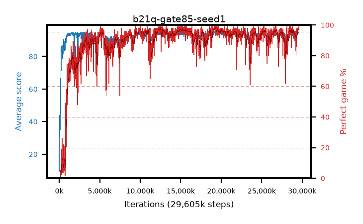

# b21q-gate85-seed1

step **29,605,888** · 1801 evals · trailing **93.93** · peak **94.3** @19,562,496 · sef **88.8** · best30 **97.6** @19,333,120

## Config

| | |
|---|---|
| algo | ppo |
| collect_envs | 128 |
| discount | 0.99 |
| eval_interval | 16384 |
| eval_queue | True |
| eval_queue_depth | 16 |
| eval_workers | 8 |
| fc_layers | (320,) |
| graph_eval_episodes | 100 |
| max_steps | 50003968 |
| min_checkpoint_score | 40.0 |
| ppo_adam_epsilon | 1e-07 |
| ppo_anneal_fraction | 1.0 |
| ppo_clip | 0.2 |
| ppo_clip_final | None |
| ppo_entropy_coef | 0.01 |
| ppo_entropy_coef_final | None |
| ppo_epochs | 4 |
| ppo_gae_lambda | 0.98 |
| ppo_gradient_clipping | 0.5 |
| ppo_horizon | 33.6 |
| ppo_learning_rate | 0.0003 |
| ppo_learning_rate_final | None |
| ppo_minibatch | 256 |
| ppo_normalize_adv | True |
| ppo_rollout | 128 |
| ppo_target_kl | 0.0 |
| ppo_transitions_per_rollout | 16384 |
| ppo_value_loss | huber |
| ppo_vf_coef | 0.5 |
| seed | 1 |
| torch_threads | 1 |

## Evals

| step | avg score | trailing avg | min score | max score | avg reward | perfect % | epsilon |
|---|---|---|---|---|---|---|---|
| 16384 | 9.54 | 28.99 | 0.0 | 28.0 | 8.13 | 0.0 |  |
| 32768 | 43.87 | 31.47 | 4.0 | 79.0 | 38.898 | 0.0 |  |
| 49152 | 34.92 | 32.48 | 10.0 | 79.0 | 29.842 | 0.0 |  |
| ... | ... | ... | ... | ... | ... | ... | ... |
| 29327360 | 93.06 | 93.85 | 33.0 | 95.0 | 187.63 | 96.0 |  |
| 29343744 | 94.34 | 93.85 | 32.0 | 95.0 | 191.015 | 98.0 |  |
| 29360128 | 93.56 | 93.82 | 19.0 | 95.0 | 189.185 | 97.0 |  |
| 29376512 | 93.37 | 93.84 | 8.0 | 95.0 | 187.075 | 95.0 |  |
| 29392896 | 94.75 | 93.85 | 73.0 | 95.0 | 191.452 | 98.0 |  |
| 29409280 | 93.97 | 93.89 | 49.0 | 95.0 | 189.69 | 97.0 |  |
| 29458432 | 93.47 | 93.8 | 16.0 | 95.0 | 188.201 | 96.0 |  |
| 29474816 | 94.72 | 93.85 | 71.0 | 95.0 | 191.446 | 98.0 |  |
| 29556736 | 94.53 | 93.87 | 55.0 | 95.0 | 191.259 | 98.0 |  |
| 29573120 | 94.48 | 93.87 | 72.0 | 95.0 | 190.201 | 97.0 |  |
| 29589504 | 94.68 | 93.85 | 63.0 | 95.0 | 192.411 | 99.0 |  |
| 29605888 | 94.98 | 93.93 | 93.0 | 95.0 | 192.702 | 99.0 |  |
