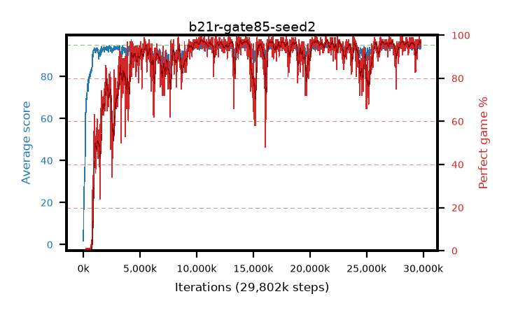

# b21r-gate85-seed2

step **29,802,496** · 1816 evals · trailing **93.79** · peak **94.3** @14,286,848 · sef **83.7** · best30 **97.4** @10,682,368

## Config

| | |
|---|---|
| algo | ppo |
| collect_envs | 128 |
| discount | 0.99 |
| eval_interval | 16384 |
| eval_queue | True |
| eval_queue_depth | 16 |
| eval_workers | 8 |
| fc_layers | (320,) |
| graph_eval_episodes | 100 |
| max_steps | 50003968 |
| min_checkpoint_score | 40.0 |
| ppo_adam_epsilon | 1e-07 |
| ppo_anneal_fraction | 1.0 |
| ppo_clip | 0.2 |
| ppo_clip_final | None |
| ppo_entropy_coef | 0.01 |
| ppo_entropy_coef_final | None |
| ppo_epochs | 4 |
| ppo_gae_lambda | 0.98 |
| ppo_gradient_clipping | 0.5 |
| ppo_horizon | 33.6 |
| ppo_learning_rate | 0.0003 |
| ppo_learning_rate_final | None |
| ppo_minibatch | 256 |
| ppo_normalize_adv | True |
| ppo_rollout | 128 |
| ppo_target_kl | 0.0 |
| ppo_transitions_per_rollout | 16384 |
| ppo_value_loss | huber |
| ppo_vf_coef | 0.5 |
| seed | 2 |
| torch_threads | 1 |

## Evals

| step | avg score | trailing avg | min score | max score | avg reward | perfect % | epsilon |
|---|---|---|---|---|---|---|---|
| 16384 | 1.73 | 1.73 | 0.0 | 5.0 | -0.874 | 0.0 |  |
| 32768 | 16.46 | 9.1 | 4.0 | 29.0 | 11.622 | 0.0 |  |
| 49152 | 21.37 | 18.29 | 4.0 | 49.0 | 16.342 | 0.0 |  |
| ... | ... | ... | ... | ... | ... | ... | ... |
| 29573120 | 94.1 | 93.75 | 30.0 | 95.0 | 190.766 | 98.0 |  |
| 29589504 | 94.06 | 93.72 | 55.0 | 95.0 | 189.782 | 97.0 |  |
| 29605888 | 93.26 | 93.74 | 8.0 | 95.0 | 187.99 | 96.0 |  |
| 29622272 | 93.44 | 93.78 | 12.0 | 95.0 | 188.182 | 96.0 |  |
| 29638656 | 95.0 | 93.78 | 95.0 | 95.0 | 193.714 | 100.0 |  |
| 29687808 | 92.96 | 93.75 | 16.0 | 95.0 | 187.688 | 96.0 |  |
| 29704192 | 93.5 | 93.78 | 10.0 | 95.0 | 188.227 | 96.0 |  |
| 29720576 | 93.08 | 93.7 | 28.0 | 95.0 | 186.799 | 95.0 |  |
| 29736960 | 93.65 | 93.77 | 18.0 | 95.0 | 188.377 | 96.0 |  |
| 29753344 | 94.3 | 93.76 | 68.0 | 95.0 | 187.027 | 94.0 |  |
| 29786112 | 94.56 | 93.8 | 72.0 | 95.0 | 191.267 | 98.0 |  |
| 29802496 | 93.51 | 93.79 | 12.0 | 95.0 | 188.224 | 96.0 |  |
