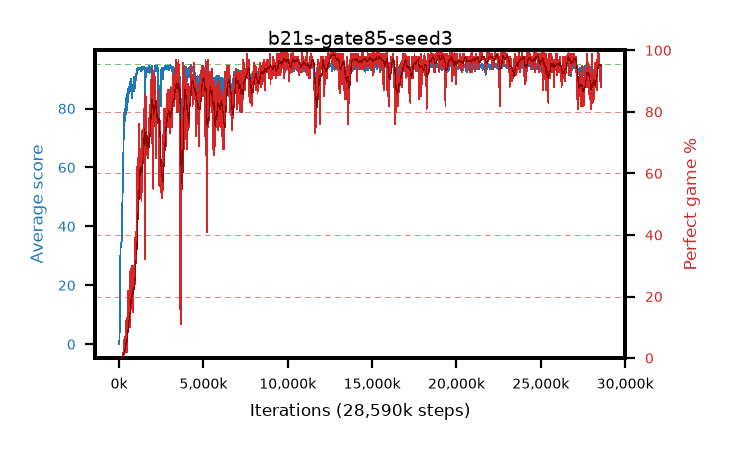

# b21s-gate85-seed3

step **28,590,080** · 1738 evals · trailing **93.47** · peak **94.48** @19,152,896 · sef **87.6** · best30 **98.1** @12,812,288

## Config

| | |
|---|---|
| algo | ppo |
| collect_envs | 128 |
| discount | 0.99 |
| eval_interval | 16384 |
| eval_queue | True |
| eval_queue_depth | 16 |
| eval_workers | 8 |
| fc_layers | (320,) |
| graph_eval_episodes | 100 |
| max_steps | 50003968 |
| min_checkpoint_score | 40.0 |
| ppo_adam_epsilon | 1e-07 |
| ppo_anneal_fraction | 1.0 |
| ppo_clip | 0.2 |
| ppo_clip_final | None |
| ppo_entropy_coef | 0.01 |
| ppo_entropy_coef_final | None |
| ppo_epochs | 4 |
| ppo_gae_lambda | 0.98 |
| ppo_gradient_clipping | 0.5 |
| ppo_horizon | 33.6 |
| ppo_learning_rate | 0.0003 |
| ppo_learning_rate_final | None |
| ppo_minibatch | 256 |
| ppo_normalize_adv | True |
| ppo_rollout | 128 |
| ppo_target_kl | 0.0 |
| ppo_transitions_per_rollout | 16384 |
| ppo_value_loss | huber |
| ppo_vf_coef | 0.5 |
| seed | 3 |
| torch_threads | 1 |

## Evals

| step | avg score | trailing avg | min score | max score | avg reward | perfect % | epsilon |
|---|---|---|---|---|---|---|---|
| 16384 | 0.02 | 0.02 | 0.0 | 1.0 | -4.492 | 0.0 |  |
| 32768 | 4.17 | 2.09 | 0.0 | 11.0 | 2.388 | 0.0 |  |
| 49152 | 18.71 | 12.2 | 0.0 | 37.0 | 14.379 | 0.0 |  |
| ... | ... | ... | ... | ... | ... | ... | ... |
| 28295168 | 94.34 | 93.1 | 68.0 | 95.0 | 187.999 | 95.0 |  |
| 28311552 | 92.5 | 93.06 | 14.0 | 95.0 | 178.18 | 87.0 |  |
| 28327936 | 93.89 | 93.09 | 18.0 | 95.0 | 186.574 | 94.0 |  |
| 28344320 | 94.45 | 93.18 | 72.0 | 95.0 | 190.129 | 97.0 |  |
| 28360704 | 94.89 | 93.26 | 90.0 | 95.0 | 190.575 | 97.0 |  |
| 28377088 | 95.0 | 93.33 | 95.0 | 95.0 | 193.682 | 100.0 |  |
| 28393472 | 94.37 | 93.53 | 34.0 | 95.0 | 191.066 | 98.0 |  |
| 28442624 | 94.68 | 93.11 | 63.0 | 95.0 | 192.383 | 99.0 |  |
| 28459008 | 94.5 | 93.39 | 67.0 | 95.0 | 190.205 | 97.0 |  |
| 28557312 | 93.51 | 93.41 | 58.0 | 95.0 | 180.237 | 88.0 |  |
| 28573696 | 93.08 | 93.53 | 65.0 | 95.0 | 182.788 | 91.0 |  |
| 28590080 | 93.6 | 93.47 | 8.0 | 95.0 | 186.305 | 94.0 |  |
