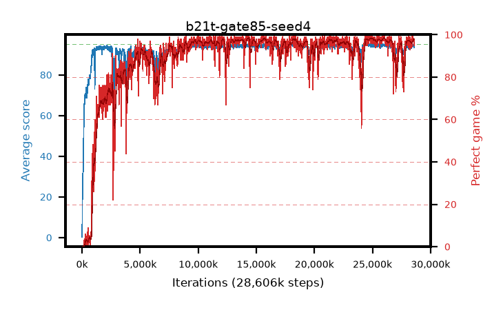

# b21t-gate85-seed4

step **28,606,464** · 1744 evals · trailing **94.18** · peak **94.71** @24,821,760 · sef **86.0** · best30 **98.0** @24,952,832

## Config

| | |
|---|---|
| algo | ppo |
| collect_envs | 128 |
| discount | 0.99 |
| eval_interval | 16384 |
| eval_queue | True |
| eval_queue_depth | 16 |
| eval_workers | 8 |
| fc_layers | (320,) |
| graph_eval_episodes | 100 |
| max_steps | 50003968 |
| min_checkpoint_score | 40.0 |
| ppo_adam_epsilon | 1e-07 |
| ppo_anneal_fraction | 1.0 |
| ppo_clip | 0.2 |
| ppo_clip_final | None |
| ppo_entropy_coef | 0.01 |
| ppo_entropy_coef_final | None |
| ppo_epochs | 4 |
| ppo_gae_lambda | 0.98 |
| ppo_gradient_clipping | 0.5 |
| ppo_horizon | 33.6 |
| ppo_learning_rate | 0.0003 |
| ppo_learning_rate_final | None |
| ppo_minibatch | 256 |
| ppo_normalize_adv | True |
| ppo_rollout | 128 |
| ppo_target_kl | 0.0 |
| ppo_transitions_per_rollout | 16384 |
| ppo_value_loss | huber |
| ppo_vf_coef | 0.5 |
| seed | 4 |
| torch_threads | 1 |

## Evals

| step | avg score | trailing avg | min score | max score | avg reward | perfect % | epsilon |
|---|---|---|---|---|---|---|---|
| 16384 | 0.27 | 0.27 | 0.0 | 3.0 | -0.639 | 0.0 |  |
| 32768 | 19.46 | 14.89 | 0.0 | 31.0 | 14.598 | 0.0 |  |
| 49152 | 24.93 | 12.6 | 5.0 | 44.0 | 19.9 | 0.0 |  |
| ... | ... | ... | ... | ... | ... | ... | ... |
| 28393472 | 94.06 | 94.17 | 62.0 | 95.0 | 187.764 | 95.0 |  |
| 28409856 | 94.85 | 94.18 | 84.0 | 95.0 | 191.56 | 98.0 |  |
| 28426240 | 94.63 | 94.15 | 58.0 | 95.0 | 192.346 | 99.0 |  |
| 28442624 | 95.0 | 94.13 | 95.0 | 95.0 | 193.717 | 100.0 |  |
| 28459008 | 94.79 | 94.21 | 74.0 | 95.0 | 192.497 | 99.0 |  |
| 28475392 | 94.43 | 94.19 | 38.0 | 95.0 | 192.142 | 99.0 |  |
| 28508160 | 94.28 | 94.23 | 26.0 | 95.0 | 190.993 | 98.0 |  |
| 28524544 | 93.92 | 94.21 | 4.0 | 95.0 | 189.622 | 97.0 |  |
| 28557312 | 94.45 | 94.2 | 59.0 | 95.0 | 191.167 | 98.0 |  |
| 28573696 | 93.31 | 94.21 | 6.0 | 95.0 | 187.044 | 95.0 |  |
| 28590080 | 94.77 | 94.23 | 78.0 | 95.0 | 191.474 | 98.0 |  |
| 28606464 | 94.28 | 94.18 | 56.0 | 95.0 | 190.009 | 97.0 |  |
