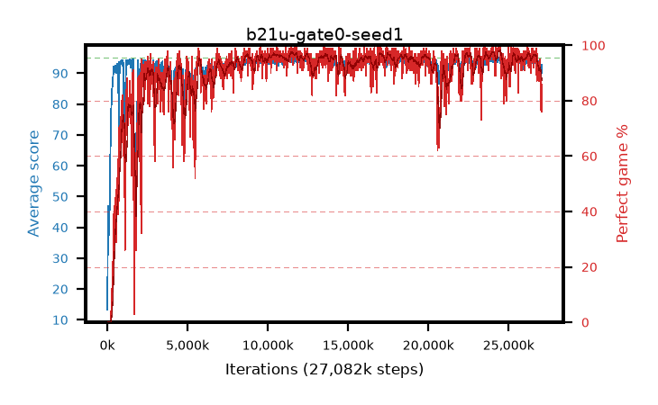

# b21u-gate0-seed1

step **27,082,752** · 1648 evals · trailing **93.49** · peak **94.33** @11,747,328 · sef **89.3** · best30 **97.2** @11,780,096

## Config

| | |
|---|---|
| algo | ppo |
| collect_envs | 128 |
| discount | 0.99 |
| eval_interval | 16384 |
| eval_queue | True |
| eval_queue_depth | 16 |
| eval_workers | 8 |
| fc_layers | (320,) |
| graph_eval_episodes | 100 |
| max_steps | 50003968 |
| min_checkpoint_score | 40.0 |
| ppo_adam_epsilon | 1e-07 |
| ppo_anneal_fraction | 1.0 |
| ppo_clip | 0.2 |
| ppo_clip_final | None |
| ppo_entropy_coef | 0.01 |
| ppo_entropy_coef_final | None |
| ppo_epochs | 4 |
| ppo_gae_lambda | 0.98 |
| ppo_gradient_clipping | 0.5 |
| ppo_horizon | 33.6 |
| ppo_learning_rate | 0.0003 |
| ppo_learning_rate_final | None |
| ppo_minibatch | 256 |
| ppo_normalize_adv | True |
| ppo_rollout | 128 |
| ppo_target_kl | 0.0 |
| ppo_transitions_per_rollout | 16384 |
| ppo_value_loss | huber |
| ppo_vf_coef | 0.5 |
| seed | 1 |
| torch_threads | 1 |

## Evals

| step | avg score | trailing avg | min score | max score | avg reward | perfect % | epsilon |
|---|---|---|---|---|---|---|---|
| 16384 | 13.29 | 30.0 | 2.0 | 38.0 | 11.577 | 0.0 |  |
| 32768 | 46.99 | 33.4 | 14.0 | 80.0 | 41.947 | 0.0 |  |
| 49152 | 39.53 | 34.42 | 14.0 | 79.0 | 34.429 | 0.0 |  |
| ... | ... | ... | ... | ... | ... | ... | ... |
| 26820608 | 93.13 | 93.88 | 65.0 | 95.0 | 180.857 | 89.0 |  |
| 26836992 | 92.67 | 93.9 | 29.0 | 95.0 | 180.351 | 89.0 |  |
| 26853376 | 93.9 | 93.92 | 71.0 | 95.0 | 185.613 | 93.0 |  |
| 26869760 | 93.71 | 93.89 | 63.0 | 95.0 | 185.419 | 93.0 |  |
| 26886144 | 93.96 | 93.96 | 26.0 | 95.0 | 186.68 | 94.0 |  |
| 26902528 | 92.47 | 93.86 | 4.0 | 95.0 | 178.19 | 87.0 |  |
| 26951680 | 94.32 | 93.89 | 67.0 | 95.0 | 188.04 | 95.0 |  |
| 26968064 | 93.92 | 93.93 | 64.0 | 95.0 | 183.635 | 91.0 |  |
| 27033600 | 89.67 | 93.74 | 30.0 | 95.0 | 164.387 | 76.0 |  |
| 27049984 | 90.29 | 93.59 | 28.0 | 95.0 | 164.974 | 76.0 |  |
| 27066368 | 92.68 | 93.44 | 64.0 | 95.0 | 177.383 | 86.0 |  |
| 27082752 | 92.03 | 93.49 | 62.0 | 95.0 | 171.749 | 81.0 |  |
