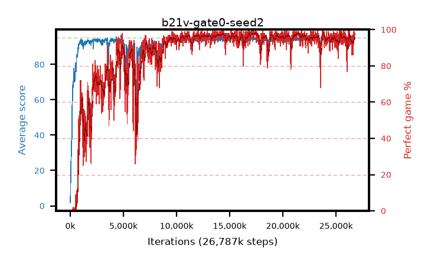

# b21v-gate0-seed2

step **26,787,840** · 1631 evals · trailing **94.02** · peak **94.49** @17,301,504 · sef **80.4** · best30 **97.9** @17,416,192

## Config

| | |
|---|---|
| algo | ppo |
| collect_envs | 128 |
| discount | 0.99 |
| eval_interval | 16384 |
| eval_queue | True |
| eval_queue_depth | 16 |
| eval_workers | 8 |
| fc_layers | (320,) |
| graph_eval_episodes | 100 |
| max_steps | 50003968 |
| min_checkpoint_score | 40.0 |
| ppo_adam_epsilon | 1e-07 |
| ppo_anneal_fraction | 1.0 |
| ppo_clip | 0.2 |
| ppo_clip_final | None |
| ppo_entropy_coef | 0.01 |
| ppo_entropy_coef_final | None |
| ppo_epochs | 4 |
| ppo_gae_lambda | 0.98 |
| ppo_gradient_clipping | 0.5 |
| ppo_horizon | 33.6 |
| ppo_learning_rate | 0.0003 |
| ppo_learning_rate_final | None |
| ppo_minibatch | 256 |
| ppo_normalize_adv | True |
| ppo_rollout | 128 |
| ppo_target_kl | 0.0 |
| ppo_transitions_per_rollout | 16384 |
| ppo_value_loss | huber |
| ppo_vf_coef | 0.5 |
| seed | 2 |
| torch_threads | 1 |

## Evals

| step | avg score | trailing avg | min score | max score | avg reward | perfect % | epsilon |
|---|---|---|---|---|---|---|---|
| 16384 | 1.8 | 1.8 | 0.0 | 7.0 | -1.161 | 0.0 |  |
| 32768 | 14.19 | 15.48 | 0.0 | 22.0 | 9.471 | 0.0 |  |
| 49152 | 21.48 | 11.64 | 4.0 | 40.0 | 16.443 | 0.0 |  |
| ... | ... | ... | ... | ... | ... | ... | ... |
| 26542080 | 93.69 | 93.93 | 41.0 | 95.0 | 184.303 | 92.0 |  |
| 26558464 | 94.7 | 93.69 | 74.0 | 95.0 | 190.335 | 97.0 |  |
| 26574848 | 94.46 | 94.01 | 78.0 | 95.0 | 189.153 | 96.0 |  |
| 26591232 | 94.38 | 94.11 | 62.0 | 95.0 | 190.061 | 97.0 |  |
| 26607616 | 92.13 | 94.01 | 43.0 | 95.0 | 176.692 | 86.0 |  |
| 26640384 | 94.85 | 93.83 | 80.0 | 95.0 | 192.523 | 99.0 |  |
| 26656768 | 94.04 | 94.1 | 70.0 | 95.0 | 184.717 | 92.0 |  |
| 26722304 | 94.92 | 94.13 | 87.0 | 95.0 | 192.613 | 99.0 |  |
| 26738688 | 94.6 | 94.01 | 69.0 | 95.0 | 191.285 | 98.0 |  |
| 26755072 | 94.73 | 94.11 | 73.0 | 95.0 | 191.431 | 98.0 |  |
| 26771456 | 94.66 | 94.02 | 79.0 | 95.0 | 190.379 | 97.0 |  |
| 26787840 | 94.54 | 94.02 | 75.0 | 95.0 | 190.251 | 97.0 |  |
