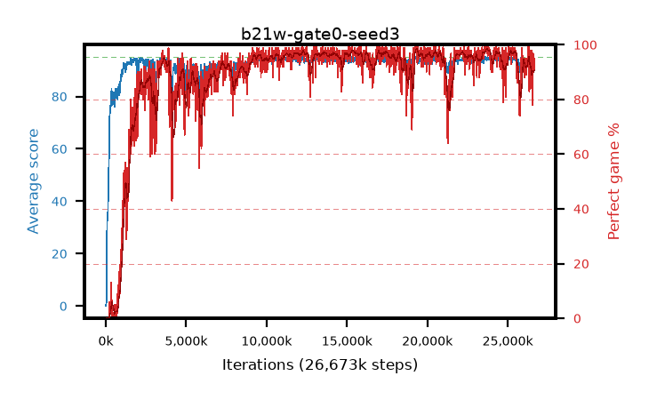

# b21w-gate0-seed3

step **26,673,152** · 1624 evals · trailing **93.49** · peak **94.41** @23,740,416 · sef **88.5** · best30 **97.9** @23,871,488

## Config

| | |
|---|---|
| algo | ppo |
| collect_envs | 128 |
| discount | 0.99 |
| eval_interval | 16384 |
| eval_queue | True |
| eval_queue_depth | 16 |
| eval_workers | 8 |
| fc_layers | (320,) |
| graph_eval_episodes | 100 |
| max_steps | 50003968 |
| min_checkpoint_score | 40.0 |
| ppo_adam_epsilon | 1e-07 |
| ppo_anneal_fraction | 1.0 |
| ppo_clip | 0.2 |
| ppo_clip_final | None |
| ppo_entropy_coef | 0.01 |
| ppo_entropy_coef_final | None |
| ppo_epochs | 4 |
| ppo_gae_lambda | 0.98 |
| ppo_gradient_clipping | 0.5 |
| ppo_horizon | 33.6 |
| ppo_learning_rate | 0.0003 |
| ppo_learning_rate_final | None |
| ppo_minibatch | 256 |
| ppo_normalize_adv | True |
| ppo_rollout | 128 |
| ppo_target_kl | 0.0 |
| ppo_transitions_per_rollout | 16384 |
| ppo_value_loss | huber |
| ppo_vf_coef | 0.5 |
| seed | 3 |
| torch_threads | 1 |

## Evals

| step | avg score | trailing avg | min score | max score | avg reward | perfect % | epsilon |
|---|---|---|---|---|---|---|---|
| 16384 | 0.06 | 0.06 | 0.0 | 1.0 | -2.732 | 0.0 |  |
| 32768 | 1.54 | 0.8 | 0.0 | 5.0 | 0.936 | 0.0 |  |
| 49152 | 13.04 | 9.05 | 0.0 | 35.0 | 9.188 | 0.0 |  |
| ... | ... | ... | ... | ... | ... | ... | ... |
| 26427392 | 92.39 | 93.73 | 34.0 | 95.0 | 181.028 | 90.0 |  |
| 26443776 | 93.96 | 93.69 | 69.0 | 95.0 | 183.663 | 91.0 |  |
| 26460160 | 92.75 | 93.64 | 18.0 | 95.0 | 180.442 | 89.0 |  |
| 26476544 | 91.68 | 93.45 | 14.0 | 95.0 | 174.38 | 84.0 |  |
| 26492928 | 93.93 | 93.76 | 59.0 | 95.0 | 183.554 | 91.0 |  |
| 26509312 | 94.77 | 93.75 | 77.0 | 95.0 | 191.435 | 98.0 |  |
| 26525696 | 92.28 | 93.45 | 72.0 | 95.0 | 169.002 | 78.0 |  |
| 26542080 | 93.38 | 93.49 | 20.0 | 95.0 | 184.092 | 92.0 |  |
| 26574848 | 94.77 | 93.51 | 83.0 | 95.0 | 190.449 | 97.0 |  |
| 26624000 | 93.62 | 93.44 | 57.0 | 95.0 | 182.339 | 90.0 |  |
| 26656768 | 94.3 | 93.45 | 74.0 | 95.0 | 187.988 | 95.0 |  |
| 26673152 | 92.98 | 93.49 | 16.0 | 95.0 | 185.683 | 94.0 |  |
