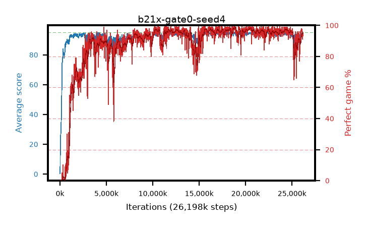

# b21x-gate0-seed4

step **26,198,016** · 1592 evals · trailing **93.5** · peak **94.53** @22,675,456 · sef **86.6** · best30 **97.8** @18,972,672

## Config

| | |
|---|---|
| algo | ppo |
| collect_envs | 128 |
| discount | 0.99 |
| eval_interval | 16384 |
| eval_queue | True |
| eval_queue_depth | 16 |
| eval_workers | 8 |
| fc_layers | (320,) |
| graph_eval_episodes | 100 |
| max_steps | 50003968 |
| min_checkpoint_score | 40.0 |
| ppo_adam_epsilon | 1e-07 |
| ppo_anneal_fraction | 1.0 |
| ppo_clip | 0.2 |
| ppo_clip_final | None |
| ppo_entropy_coef | 0.01 |
| ppo_entropy_coef_final | None |
| ppo_epochs | 4 |
| ppo_gae_lambda | 0.98 |
| ppo_gradient_clipping | 0.5 |
| ppo_horizon | 33.6 |
| ppo_learning_rate | 0.0003 |
| ppo_learning_rate_final | None |
| ppo_minibatch | 256 |
| ppo_normalize_adv | True |
| ppo_rollout | 128 |
| ppo_target_kl | 0.0 |
| ppo_transitions_per_rollout | 16384 |
| ppo_value_loss | huber |
| ppo_vf_coef | 0.5 |
| seed | 4 |
| torch_threads | 1 |

## Evals

| step | avg score | trailing avg | min score | max score | avg reward | perfect % | epsilon |
|---|---|---|---|---|---|---|---|
| 16384 | 0.32 | 0.32 | 0.0 | 2.0 | -0.544 | 0.0 |  |
| 32768 | 14.59 | 7.46 | 1.0 | 37.0 | 10.701 | 0.0 |  |
| 49152 | 22.26 | 12.39 | 7.0 | 41.0 | 17.239 | 0.0 |  |
| ... | ... | ... | ... | ... | ... | ... | ... |
| 25903104 | 94.65 | 92.95 | 82.0 | 95.0 | 189.282 | 96.0 |  |
| 25919488 | 93.83 | 92.99 | 69.0 | 95.0 | 184.524 | 92.0 |  |
| 25935872 | 94.28 | 93.17 | 68.0 | 95.0 | 188.972 | 96.0 |  |
| 25952256 | 93.56 | 92.97 | 63.0 | 95.0 | 184.248 | 92.0 |  |
| 25968640 | 94.41 | 93.08 | 71.0 | 95.0 | 189.107 | 96.0 |  |
| 25985024 | 94.35 | 93.52 | 63.0 | 95.0 | 190.053 | 97.0 |  |
| 26017792 | 94.57 | 93.34 | 63.0 | 95.0 | 190.226 | 97.0 |  |
| 26034176 | 94.1 | 93.48 | 12.0 | 95.0 | 190.795 | 98.0 |  |
| 26132480 | 94.49 | 93.52 | 61.0 | 95.0 | 188.142 | 95.0 |  |
| 26148864 | 93.33 | 93.5 | 40.0 | 95.0 | 183.053 | 91.0 |  |
| 26165248 | 93.7 | 93.5 | 42.0 | 95.0 | 187.42 | 95.0 |  |
| 26198016 | 93.98 | 93.5 | 65.0 | 95.0 | 187.686 | 95.0 |  |
