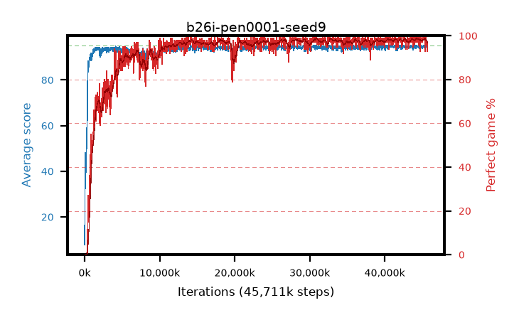

# b26i-pen0001-seed9

step **45,711,360** · 1392 evals · trailing **94.56** · peak **94.68** @41,189,376 · sef **91.5** · best30 **98.5** @44,466,176

## Config

| | |
|---|---|
| algo | ppo |
| collect_envs | 128 |
| discount | 0.99 |
| eval_interval | 32768 |
| eval_queue | True |
| eval_queue_depth | 16 |
| eval_workers | 8 |
| fc_layers | (320,) |
| graph_eval_episodes | 100 |
| max_steps | 50003968 |
| min_checkpoint_score | 40.0 |
| ppo_adam_epsilon | 1e-07 |
| ppo_anneal_fraction | 0.5 |
| ppo_clip | 0.2 |
| ppo_clip_final | None |
| ppo_discount_final | 0.999 |
| ppo_entropy_coef | 0.01 |
| ppo_entropy_coef_final | 0.001 |
| ppo_epochs | 4 |
| ppo_gae_lambda | 0.95 |
| ppo_gae_lambda_final | 0.999 |
| ppo_gradient_clipping | 0.5 |
| ppo_horizon | 16.8 |
| ppo_horizon_final | 500.3 |
| ppo_learning_rate | 0.00025 |
| ppo_learning_rate_final | None |
| ppo_minibatch | 512 |
| ppo_normalize_adv | True |
| ppo_rollout | 256 |
| ppo_target_kl | 0.0 |
| ppo_transitions_per_rollout | 32768 |
| ppo_value_loss | huber |
| ppo_vf_coef | 0.5 |
| seed | 9 |
| torch_threads | 1 |

## Evals

| step | avg score | trailing avg | min score | max score | avg reward | perfect % | epsilon |
|---|---|---|---|---|---|---|---|
| 32768 | 7.86 | 7.86 | 0.0 | 25.0 | 7.207 | 0.0 |  |
| 65536 | 39.99 | 34.75 | 2.0 | 78.0 | 37.604 | 0.0 |  |
| 98304 | 48.09 | 36.97 | 3.0 | 81.0 | 44.377 | 0.0 |  |
| ... | ... | ... | ... | ... | ... | ... | ... |
| 45252608 | 94.13 | 94.56 | 8.0 | 95.0 | 191.84 | 99.0 |  |
| 45285376 | 95.0 | 94.59 | 95.0 | 95.0 | 193.718 | 100.0 |  |
| 45318144 | 95.0 | 94.56 | 95.0 | 95.0 | 193.703 | 100.0 |  |
| 45350912 | 94.97 | 94.56 | 92.0 | 95.0 | 192.68 | 99.0 |  |
| 45383680 | 94.98 | 94.54 | 93.0 | 95.0 | 192.645 | 99.0 |  |
| 45416448 | 93.93 | 94.53 | 67.0 | 95.0 | 185.665 | 93.0 |  |
| 45449216 | 94.77 | 94.55 | 86.0 | 95.0 | 189.438 | 96.0 |  |
| 45481984 | 95.0 | 94.57 | 95.0 | 95.0 | 193.713 | 100.0 |  |
| 45514752 | 94.51 | 94.56 | 68.0 | 95.0 | 189.18 | 96.0 |  |
| 45645824 | 94.35 | 94.57 | 58.0 | 95.0 | 189.072 | 96.0 |  |
| 45678592 | 94.33 | 94.56 | 66.0 | 95.0 | 186.048 | 93.0 |  |
| 45711360 | 94.62 | 94.56 | 80.0 | 95.0 | 190.328 | 97.0 |  |
