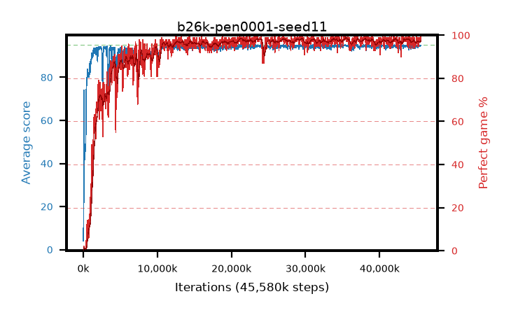

# b26k-pen0001-seed11

step **45,580,288** · 1388 evals · trailing **94.35** · peak **94.63** @35,651,584 · sef **91.6** · best30 **98.3** @35,782,656

## Config

| | |
|---|---|
| algo | ppo |
| collect_envs | 128 |
| discount | 0.99 |
| eval_interval | 32768 |
| eval_queue | True |
| eval_queue_depth | 16 |
| eval_workers | 8 |
| fc_layers | (320,) |
| graph_eval_episodes | 100 |
| max_steps | 50003968 |
| min_checkpoint_score | 40.0 |
| ppo_adam_epsilon | 1e-07 |
| ppo_anneal_fraction | 0.5 |
| ppo_clip | 0.2 |
| ppo_clip_final | None |
| ppo_discount_final | 0.999 |
| ppo_entropy_coef | 0.01 |
| ppo_entropy_coef_final | 0.001 |
| ppo_epochs | 4 |
| ppo_gae_lambda | 0.95 |
| ppo_gae_lambda_final | 0.999 |
| ppo_gradient_clipping | 0.5 |
| ppo_horizon | 16.8 |
| ppo_horizon_final | 500.3 |
| ppo_learning_rate | 0.00025 |
| ppo_learning_rate_final | None |
| ppo_minibatch | 512 |
| ppo_normalize_adv | True |
| ppo_rollout | 256 |
| ppo_target_kl | 0.0 |
| ppo_transitions_per_rollout | 32768 |
| ppo_value_loss | huber |
| ppo_vf_coef | 0.5 |
| seed | 11 |
| torch_threads | 1 |

## Evals

| step | avg score | trailing avg | min score | max score | avg reward | perfect % | epsilon |
|---|---|---|---|---|---|---|---|
| 32768 | 4.05 | 4.05 | 0.0 | 12.0 | 1.456 | 0.0 |  |
| 65536 | 27.38 | 15.71 | 1.0 | 95.0 | 28.245 | 2.0 |  |
| 98304 | 73.99 | 42.12 | 13.0 | 95.0 | 73.931 | 2.0 |  |
| ... | ... | ... | ... | ... | ... | ... | ... |
| 45121536 | 93.83 | 94.3 | 18.0 | 95.0 | 189.562 | 97.0 |  |
| 45154304 | 93.83 | 94.26 | 60.0 | 95.0 | 187.571 | 95.0 |  |
| 45187072 | 94.69 | 94.28 | 64.0 | 95.0 | 192.414 | 99.0 |  |
| 45219840 | 94.35 | 94.3 | 70.0 | 95.0 | 189.085 | 96.0 |  |
| 45252608 | 94.38 | 94.29 | 73.0 | 95.0 | 188.108 | 95.0 |  |
| 45285376 | 94.38 | 94.32 | 58.0 | 95.0 | 190.109 | 97.0 |  |
| 45318144 | 94.63 | 94.33 | 58.0 | 95.0 | 192.368 | 99.0 |  |
| 45350912 | 94.28 | 94.33 | 64.0 | 95.0 | 190.009 | 97.0 |  |
| 45449216 | 94.51 | 94.35 | 76.0 | 95.0 | 190.249 | 97.0 |  |
| 45514752 | 94.88 | 94.36 | 83.0 | 95.0 | 192.599 | 99.0 |  |
| 45547520 | 94.6 | 94.32 | 65.0 | 95.0 | 191.322 | 98.0 |  |
| 45580288 | 94.7 | 94.35 | 65.0 | 95.0 | 192.421 | 99.0 |  |
