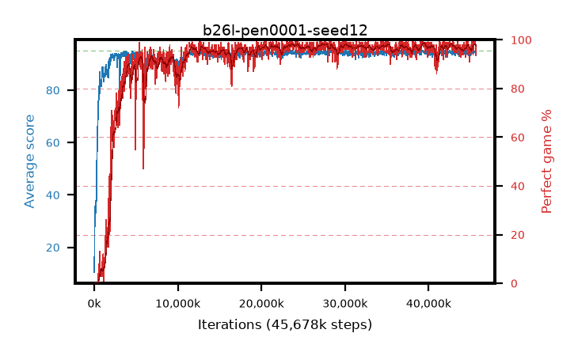

# b26l-pen0001-seed12

step **45,678,592** · 1390 evals · trailing **94.13** · peak **94.52** @30,310,400 · sef **92.0** · best30 **98.1** @27,852,800

## Config

| | |
|---|---|
| algo | ppo |
| collect_envs | 128 |
| discount | 0.99 |
| eval_interval | 32768 |
| eval_queue | True |
| eval_queue_depth | 16 |
| eval_workers | 8 |
| fc_layers | (320,) |
| graph_eval_episodes | 100 |
| max_steps | 50003968 |
| min_checkpoint_score | 40.0 |
| ppo_adam_epsilon | 1e-07 |
| ppo_anneal_fraction | 0.5 |
| ppo_clip | 0.2 |
| ppo_clip_final | None |
| ppo_discount_final | 0.999 |
| ppo_entropy_coef | 0.01 |
| ppo_entropy_coef_final | 0.001 |
| ppo_epochs | 4 |
| ppo_gae_lambda | 0.95 |
| ppo_gae_lambda_final | 0.999 |
| ppo_gradient_clipping | 0.5 |
| ppo_horizon | 16.8 |
| ppo_horizon_final | 500.3 |
| ppo_learning_rate | 0.00025 |
| ppo_learning_rate_final | None |
| ppo_minibatch | 512 |
| ppo_normalize_adv | True |
| ppo_rollout | 256 |
| ppo_target_kl | 0.0 |
| ppo_transitions_per_rollout | 32768 |
| ppo_value_loss | huber |
| ppo_vf_coef | 0.5 |
| seed | 12 |
| torch_threads | 1 |

## Evals

| step | avg score | trailing avg | min score | max score | avg reward | perfect % | epsilon |
|---|---|---|---|---|---|---|---|
| 32768 | 10.49 | 10.49 | 1.0 | 31.0 | 7.602 | 0.0 |  |
| 65536 | 33.33 | 21.91 | 1.0 | 72.0 | 28.625 | 0.0 |  |
| 98304 | 35.54 | 27.21 | 8.0 | 69.0 | 30.669 | 0.0 |  |
| ... | ... | ... | ... | ... | ... | ... | ... |
| 45187072 | 94.7 | 94.19 | 65.0 | 95.0 | 192.427 | 99.0 |  |
| 45219840 | 94.27 | 94.16 | 55.0 | 95.0 | 190.99 | 98.0 |  |
| 45252608 | 94.93 | 94.19 | 88.0 | 95.0 | 192.65 | 99.0 |  |
| 45285376 | 94.47 | 94.19 | 56.0 | 95.0 | 191.207 | 98.0 |  |
| 45318144 | 93.86 | 94.14 | 62.0 | 95.0 | 186.598 | 94.0 |  |
| 45350912 | 95.0 | 94.22 | 95.0 | 95.0 | 193.725 | 100.0 |  |
| 45383680 | 94.28 | 94.19 | 55.0 | 95.0 | 191.008 | 98.0 |  |
| 45514752 | 94.72 | 94.22 | 67.0 | 95.0 | 192.442 | 99.0 |  |
| 45580288 | 94.67 | 94.22 | 62.0 | 95.0 | 192.387 | 99.0 |  |
| 45613056 | 93.62 | 94.2 | 10.0 | 95.0 | 188.348 | 96.0 |  |
| 45645824 | 94.66 | 94.19 | 67.0 | 95.0 | 191.385 | 98.0 |  |
| 45678592 | 93.23 | 94.13 | 50.0 | 95.0 | 185.961 | 94.0 |  |
