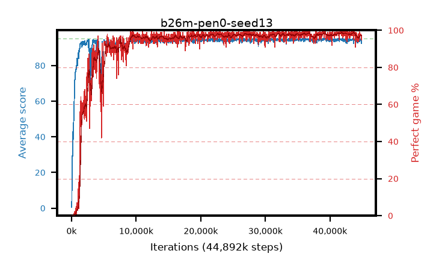

# b26m-pen0-seed13

step **44,892,160** · 1366 evals · trailing **93.96** · peak **94.6** @36,601,856 · sef **91.7** · best30 **98.5** @42,434,560

## Config

| | |
|---|---|
| algo | ppo |
| collect_envs | 128 |
| discount | 0.99 |
| eval_interval | 32768 |
| eval_queue | True |
| eval_queue_depth | 16 |
| eval_workers | 8 |
| fc_layers | (320,) |
| graph_eval_episodes | 100 |
| max_steps | 50003968 |
| min_checkpoint_score | 40.0 |
| ppo_adam_epsilon | 1e-07 |
| ppo_anneal_fraction | 0.5 |
| ppo_clip | 0.2 |
| ppo_clip_final | None |
| ppo_discount_final | 0.999 |
| ppo_entropy_coef | 0.01 |
| ppo_entropy_coef_final | 0.001 |
| ppo_epochs | 4 |
| ppo_gae_lambda | 0.95 |
| ppo_gae_lambda_final | 0.999 |
| ppo_gradient_clipping | 0.5 |
| ppo_horizon | 16.8 |
| ppo_horizon_final | 500.3 |
| ppo_learning_rate | 0.00025 |
| ppo_learning_rate_final | None |
| ppo_minibatch | 512 |
| ppo_normalize_adv | True |
| ppo_rollout | 256 |
| ppo_target_kl | 0.0 |
| ppo_transitions_per_rollout | 32768 |
| ppo_value_loss | huber |
| ppo_vf_coef | 0.5 |
| seed | 13 |
| torch_threads | 1 |

## Evals

| step | avg score | trailing avg | min score | max score | avg reward | perfect % | epsilon |
|---|---|---|---|---|---|---|---|
| 32768 | 0.51 | 0.51 | 0.0 | 4.0 | -3.385 | 0.0 |  |
| 65536 | 11.54 | 6.02 | 1.0 | 35.0 | 7.767 | 0.0 |  |
| 98304 | 25.41 | 12.49 | 9.0 | 45.0 | 20.363 | 0.0 |  |
| ... | ... | ... | ... | ... | ... | ... | ... |
| 44400640 | 93.86 | 94.15 | 65.0 | 95.0 | 186.597 | 94.0 |  |
| 44433408 | 94.8 | 94.04 | 82.0 | 95.0 | 191.519 | 98.0 |  |
| 44466176 | 94.71 | 93.98 | 73.0 | 95.0 | 191.435 | 98.0 |  |
| 44498944 | 93.27 | 94.07 | 22.0 | 95.0 | 187.007 | 95.0 |  |
| 44531712 | 94.95 | 93.98 | 90.0 | 95.0 | 192.665 | 99.0 |  |
| 44564480 | 94.95 | 94.09 | 90.0 | 95.0 | 192.662 | 99.0 |  |
| 44597248 | 93.47 | 94.06 | 30.0 | 95.0 | 188.211 | 96.0 |  |
| 44630016 | 93.92 | 93.96 | 45.0 | 95.0 | 189.598 | 97.0 |  |
| 44662784 | 94.56 | 94.02 | 58.0 | 95.0 | 190.247 | 97.0 |  |
| 44793856 | 94.73 | 94.03 | 71.0 | 95.0 | 191.45 | 98.0 |  |
| 44859392 | 93.97 | 94.01 | 59.0 | 95.0 | 188.696 | 96.0 |  |
| 44892160 | 92.51 | 93.96 | 14.0 | 95.0 | 186.243 | 95.0 |  |
