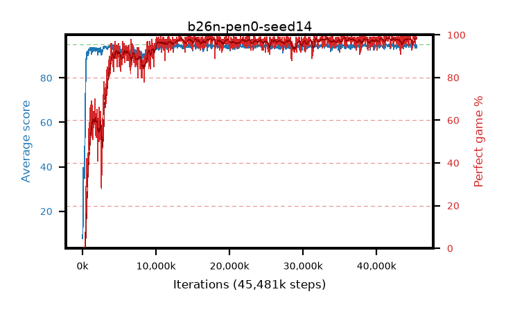

# b26n-pen0-seed14

step **45,481,984** · 1385 evals · trailing **94.58** · peak **94.64** @45,088,768 · sef **92.6** · best30 **98.2** @42,172,416

## Config

| | |
|---|---|
| algo | ppo |
| collect_envs | 128 |
| discount | 0.99 |
| eval_interval | 32768 |
| eval_queue | True |
| eval_queue_depth | 16 |
| eval_workers | 8 |
| fc_layers | (320,) |
| graph_eval_episodes | 100 |
| max_steps | 50003968 |
| min_checkpoint_score | 40.0 |
| ppo_adam_epsilon | 1e-07 |
| ppo_anneal_fraction | 0.5 |
| ppo_clip | 0.2 |
| ppo_clip_final | None |
| ppo_discount_final | 0.999 |
| ppo_entropy_coef | 0.01 |
| ppo_entropy_coef_final | 0.001 |
| ppo_epochs | 4 |
| ppo_gae_lambda | 0.95 |
| ppo_gae_lambda_final | 0.999 |
| ppo_gradient_clipping | 0.5 |
| ppo_horizon | 16.8 |
| ppo_horizon_final | 500.3 |
| ppo_learning_rate | 0.00025 |
| ppo_learning_rate_final | None |
| ppo_minibatch | 512 |
| ppo_normalize_adv | True |
| ppo_rollout | 256 |
| ppo_target_kl | 0.0 |
| ppo_transitions_per_rollout | 32768 |
| ppo_value_loss | huber |
| ppo_vf_coef | 0.5 |
| seed | 14 |
| torch_threads | 1 |

## Evals

| step | avg score | trailing avg | min score | max score | avg reward | perfect % | epsilon |
|---|---|---|---|---|---|---|---|
| 32768 | 7.7 | 7.7 | 1.0 | 24.0 | 6.33 | 0.0 |  |
| 65536 | 14.53 | 11.12 | 1.0 | 45.0 | 12.963 | 0.0 |  |
| 98304 | 39.7 | 24.64 | 11.0 | 75.0 | 34.763 | 0.0 |  |
| ... | ... | ... | ... | ... | ... | ... | ... |
| 45023232 | 95.0 | 94.63 | 95.0 | 95.0 | 193.713 | 100.0 |  |
| 45056000 | 94.78 | 94.61 | 82.0 | 95.0 | 191.495 | 98.0 |  |
| 45088768 | 94.71 | 94.64 | 66.0 | 95.0 | 192.437 | 99.0 |  |
| 45121536 | 94.54 | 94.62 | 65.0 | 95.0 | 191.268 | 98.0 |  |
| 45154304 | 94.71 | 94.64 | 66.0 | 95.0 | 192.434 | 99.0 |  |
| 45187072 | 94.49 | 94.63 | 62.0 | 95.0 | 190.22 | 97.0 |  |
| 45219840 | 94.12 | 94.61 | 30.0 | 95.0 | 188.797 | 96.0 |  |
| 45252608 | 93.46 | 94.56 | 18.0 | 95.0 | 188.171 | 96.0 |  |
| 45285376 | 95.0 | 94.58 | 95.0 | 95.0 | 193.697 | 100.0 |  |
| 45416448 | 94.93 | 94.58 | 88.0 | 95.0 | 192.598 | 99.0 |  |
| 45449216 | 93.44 | 94.56 | 8.0 | 95.0 | 190.169 | 98.0 |  |
| 45481984 | 94.69 | 94.58 | 69.0 | 95.0 | 191.397 | 98.0 |  |
