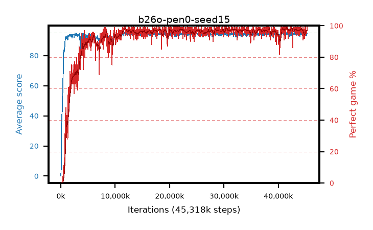

# b26o-pen0-seed15

step **45,318,144** · 1380 evals · trailing **94.16** · peak **94.67** @41,680,896 · sef **92.1** · best30 **98.0** @41,517,056

## Config

| | |
|---|---|
| algo | ppo |
| collect_envs | 128 |
| discount | 0.99 |
| eval_interval | 32768 |
| eval_queue | True |
| eval_queue_depth | 16 |
| eval_workers | 8 |
| fc_layers | (320,) |
| graph_eval_episodes | 100 |
| max_steps | 50003968 |
| min_checkpoint_score | 40.0 |
| ppo_adam_epsilon | 1e-07 |
| ppo_anneal_fraction | 0.5 |
| ppo_clip | 0.2 |
| ppo_clip_final | None |
| ppo_discount_final | 0.999 |
| ppo_entropy_coef | 0.01 |
| ppo_entropy_coef_final | 0.001 |
| ppo_epochs | 4 |
| ppo_gae_lambda | 0.95 |
| ppo_gae_lambda_final | 0.999 |
| ppo_gradient_clipping | 0.5 |
| ppo_horizon | 16.8 |
| ppo_horizon_final | 500.3 |
| ppo_learning_rate | 0.00025 |
| ppo_learning_rate_final | None |
| ppo_minibatch | 512 |
| ppo_normalize_adv | True |
| ppo_rollout | 256 |
| ppo_target_kl | 0.0 |
| ppo_transitions_per_rollout | 32768 |
| ppo_value_loss | huber |
| ppo_vf_coef | 0.5 |
| seed | 15 |
| torch_threads | 1 |

## Evals

| step | avg score | trailing avg | min score | max score | avg reward | perfect % | epsilon |
|---|---|---|---|---|---|---|---|
| 32768 | 0.13 | 0.13 | 0.0 | 2.0 | -0.419 | 0.0 |  |
| 65536 | 5.38 | 2.75 | 0.0 | 30.0 | 4.347 | 0.0 |  |
| 98304 | 28.78 | 21.24 | 5.0 | 57.0 | 24.446 | 0.0 |  |
| ... | ... | ... | ... | ... | ... | ... | ... |
| 44859392 | 94.18 | 94.32 | 39.0 | 95.0 | 189.855 | 97.0 |  |
| 44892160 | 94.56 | 94.23 | 58.0 | 95.0 | 191.239 | 98.0 |  |
| 44924928 | 94.56 | 94.22 | 62.0 | 95.0 | 191.289 | 98.0 |  |
| 44957696 | 95.0 | 94.27 | 95.0 | 95.0 | 193.716 | 100.0 |  |
| 44990464 | 94.28 | 94.2 | 58.0 | 95.0 | 191.017 | 98.0 |  |
| 45023232 | 93.67 | 94.24 | 58.0 | 95.0 | 186.407 | 94.0 |  |
| 45056000 | 94.31 | 94.28 | 63.0 | 95.0 | 190.04 | 97.0 |  |
| 45088768 | 92.99 | 94.16 | 8.0 | 95.0 | 187.739 | 96.0 |  |
| 45187072 | 93.38 | 94.24 | 20.0 | 95.0 | 187.12 | 95.0 |  |
| 45252608 | 94.21 | 94.21 | 57.0 | 95.0 | 189.94 | 97.0 |  |
| 45285376 | 94.37 | 94.25 | 54.0 | 95.0 | 191.089 | 98.0 |  |
| 45318144 | 94.74 | 94.16 | 69.0 | 95.0 | 192.456 | 99.0 |  |
