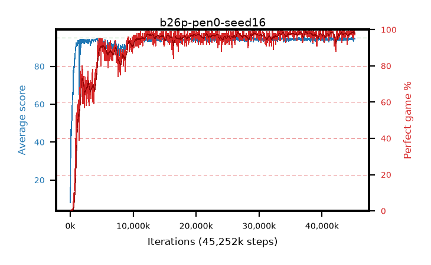

# b26p-pen0-seed16

step **45,252,608** · 1377 evals · trailing **94.56** · peak **94.58** @44,597,248 · sef **90.1** · best30 **98.3** @38,043,648

## Config

| | |
|---|---|
| algo | ppo |
| collect_envs | 128 |
| discount | 0.99 |
| eval_interval | 32768 |
| eval_queue | True |
| eval_queue_depth | 16 |
| eval_workers | 8 |
| fc_layers | (320,) |
| graph_eval_episodes | 100 |
| max_steps | 50003968 |
| min_checkpoint_score | 40.0 |
| ppo_adam_epsilon | 1e-07 |
| ppo_anneal_fraction | 0.5 |
| ppo_clip | 0.2 |
| ppo_clip_final | None |
| ppo_discount_final | 0.999 |
| ppo_entropy_coef | 0.01 |
| ppo_entropy_coef_final | 0.001 |
| ppo_epochs | 4 |
| ppo_gae_lambda | 0.95 |
| ppo_gae_lambda_final | 0.999 |
| ppo_gradient_clipping | 0.5 |
| ppo_horizon | 16.8 |
| ppo_horizon_final | 500.3 |
| ppo_learning_rate | 0.00025 |
| ppo_learning_rate_final | None |
| ppo_minibatch | 512 |
| ppo_normalize_adv | True |
| ppo_rollout | 256 |
| ppo_target_kl | 0.0 |
| ppo_transitions_per_rollout | 32768 |
| ppo_value_loss | huber |
| ppo_vf_coef | 0.5 |
| seed | 16 |
| torch_threads | 1 |

## Evals

| step | avg score | trailing avg | min score | max score | avg reward | perfect % | epsilon |
|---|---|---|---|---|---|---|---|
| 32768 | 8.07 | 8.07 | 0.0 | 30.0 | 5.798 | 0.0 |  |
| 65536 | 39.34 | 23.71 | 2.0 | 63.0 | 34.513 | 0.0 |  |
| 98304 | 46.75 | 31.39 | 20.0 | 65.0 | 41.68 | 0.0 |  |
| ... | ... | ... | ... | ... | ... | ... | ... |
| 44761088 | 94.97 | 94.51 | 92.0 | 95.0 | 192.684 | 99.0 |  |
| 44793856 | 93.85 | 94.46 | 24.0 | 95.0 | 189.565 | 97.0 |  |
| 44826624 | 94.94 | 94.53 | 89.0 | 95.0 | 192.658 | 99.0 |  |
| 44859392 | 94.28 | 94.47 | 59.0 | 95.0 | 189.002 | 96.0 |  |
| 44892160 | 94.7 | 94.49 | 65.0 | 95.0 | 192.42 | 99.0 |  |
| 44924928 | 94.83 | 94.56 | 78.0 | 95.0 | 192.544 | 99.0 |  |
| 44957696 | 95.0 | 94.51 | 95.0 | 95.0 | 193.715 | 100.0 |  |
| 44990464 | 93.3 | 94.57 | 8.0 | 95.0 | 187.039 | 95.0 |  |
| 45023232 | 94.08 | 94.56 | 14.0 | 95.0 | 190.807 | 98.0 |  |
| 45154304 | 94.91 | 94.56 | 86.0 | 95.0 | 192.625 | 99.0 |  |
| 45219840 | 94.42 | 94.56 | 69.0 | 95.0 | 190.14 | 97.0 |  |
| 45252608 | 94.6 | 94.56 | 75.0 | 95.0 | 190.289 | 97.0 |  |
