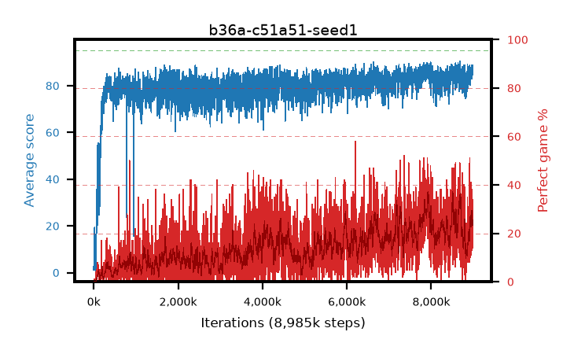

# b36a-c51a51-seed1

step **8,985,000** · 3593 evals · trailing **85.39** · peak **86.31** @7,932,500 · sef **0.0** · best30 **32.4** @7,945,000

## Config

| | |
|---|---|
| adam_epsilon | 0.0003125 |
| algo | c51 |
| batch_size | 32 |
| beta_anneal_steps | 300000 |
| collect_envs | 1 |
| discount | 0.99 |
| dist_atoms | 51 |
| dist_embedding | 64 |
| dist_fraction_entropy | 0.001 |
| dist_fraction_lr | 2.5e-09 |
| dist_kappa | 1.0 |
| dist_policy_samples | 32 |
| dist_quantiles | 32 |
| dist_risk_alpha | 1.0 |
| dist_risk_train | False |
| dist_tau_prime_samples | 64 |
| dist_tau_samples | 64 |
| dist_v_max | 110.0 |
| dist_v_min | -10.0 |
| epsilon_anneal_steps | 250000 |
| epsilon_schedule | linear |
| eval_interval | 2500 |
| eval_queue | True |
| eval_queue_depth | 16 |
| eval_workers | 8 |
| fc_layers | (320,) |
| fork_branches | 1 |
| gradient_clipping | 0.0 |
| graph_eval_episodes | 100 |
| guided_fraction | 0.0 |
| init_from | None |
| initial_collect_steps | 20000 |
| initial_epsilon | 1.0 |
| is_beta | 0.4 |
| is_beta_final | 1.0 |
| is_weights | False |
| learning_rate | 0.00025 |
| max_steps | 10000000 |
| min_checkpoint_score | 40.0 |
| min_epsilon | 0.01 |
| munchausen_alpha | 0.0 |
| munchausen_l0 | -1.0 |
| munchausen_tau | 0.03 |
| n_step_update | 1 |
| priority_exponent | 0.0 |
| replay_buffer_max_length | 1000000 |
| replay_ratio | 0.25 |
| seed | 1 |
| target_update_period | 2000 |
| target_update_tau | 1.0 |
| torch_threads | 1 |

## Evals

| step | avg score | trailing avg | min score | max score | avg reward | perfect % | epsilon |
|---|---|---|---|---|---|---|---|
| 2500 | 1.01 | 1.01 | 0.0 | 7.0 | 0.453 | 0.0 | 0.9901 |
| 5000 | 3.3 | 2.15 | 0.0 | 31.0 | 2.705 | 0.0 | 0.9802 |
| 7500 | 2.77 | 2.07 | 0.0 | 71.0 | 2.175 | 0.0 | 0.9703 |
| ... | ... | ... | ... | ... | ... | ... | ... |
| 8955000 | 83.6 | 84.7 | 45.0 | 95.0 | 97.339 | 15.0 | 0.01 |
| 8957500 | 84.71 | 84.8 | 45.0 | 95.0 | 111.445 | 28.0 | 0.01 |
| 8960000 | 84.76 | 84.89 | 33.0 | 95.0 | 107.505 | 24.0 | 0.01 |
| 8962500 | 82.94 | 84.74 | 25.0 | 95.0 | 100.697 | 19.0 | 0.01 |
| 8965000 | 84.71 | 84.92 | 7.0 | 95.0 | 116.413 | 33.0 | 0.01 |
| 8967500 | 82.98 | 85.05 | 35.0 | 95.0 | 94.735 | 13.0 | 0.01 |
| 8970000 | 86.34 | 85.24 | 14.0 | 95.0 | 110.037 | 25.0 | 0.01 |
| 8972500 | 84.62 | 84.9 | 47.0 | 95.0 | 97.355 | 14.0 | 0.01 |
| 8975000 | 88.79 | 85.0 | 48.0 | 95.0 | 118.471 | 31.0 | 0.01 |
| 8977500 | 86.4 | 85.34 | 32.0 | 95.0 | 115.088 | 30.0 | 0.01 |
| 8980000 | 84.87 | 85.35 | 24.0 | 95.0 | 116.578 | 33.0 | 0.01 |
| 8985000 | 88.74 | 85.39 | 63.0 | 95.0 | 121.393 | 34.0 | 0.01 |
