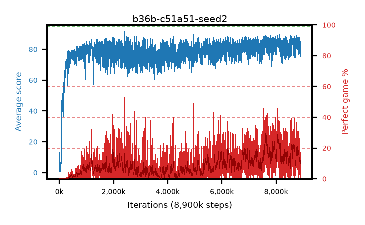

# b36b-c51a51-seed2

step **8,900,000** · 3560 evals · trailing **81.78** · peak **85.74** @7,645,000 · sef **0.0** · best30 **26.8** @7,652,500

## Config

| | |
|---|---|
| adam_epsilon | 0.0003125 |
| algo | c51 |
| batch_size | 32 |
| beta_anneal_steps | 300000 |
| collect_envs | 1 |
| discount | 0.99 |
| dist_atoms | 51 |
| dist_embedding | 64 |
| dist_fraction_entropy | 0.001 |
| dist_fraction_lr | 2.5e-09 |
| dist_kappa | 1.0 |
| dist_policy_samples | 32 |
| dist_quantiles | 32 |
| dist_risk_alpha | 1.0 |
| dist_risk_train | False |
| dist_tau_prime_samples | 64 |
| dist_tau_samples | 64 |
| dist_v_max | 110.0 |
| dist_v_min | -10.0 |
| epsilon_anneal_steps | 250000 |
| epsilon_schedule | linear |
| eval_interval | 2500 |
| eval_queue | True |
| eval_queue_depth | 16 |
| eval_workers | 8 |
| fc_layers | (320,) |
| fork_branches | 1 |
| gradient_clipping | 0.0 |
| graph_eval_episodes | 100 |
| guided_fraction | 0.0 |
| init_from | None |
| initial_collect_steps | 20000 |
| initial_epsilon | 1.0 |
| is_beta | 0.4 |
| is_beta_final | 1.0 |
| is_weights | False |
| learning_rate | 0.00025 |
| max_steps | 10000000 |
| min_checkpoint_score | 40.0 |
| min_epsilon | 0.01 |
| munchausen_alpha | 0.0 |
| munchausen_l0 | -1.0 |
| munchausen_tau | 0.03 |
| n_step_update | 1 |
| priority_exponent | 0.0 |
| replay_buffer_max_length | 1000000 |
| replay_ratio | 0.25 |
| seed | 2 |
| target_update_period | 2000 |
| target_update_tau | 1.0 |
| torch_threads | 1 |

## Evals

| step | avg score | trailing avg | min score | max score | avg reward | perfect % | epsilon |
|---|---|---|---|---|---|---|---|
| 2500 | 13.24 | 3.41 | 0.0 | 85.0 | 12.361 | 0.0 | 0.9901 |
| 5000 | 2.66 | 2.66 | 0.0 | 8.0 | 2.081 | 0.0 | 0.9802 |
| 7500 | 2.39 | 2.53 | 1.0 | 10.0 | 1.817 | 0.0 | 0.9703 |
| ... | ... | ... | ... | ... | ... | ... | ... |
| 8872500 | 76.99 | 82.93 | 41.0 | 95.0 | 78.353 | 3.0 | 0.01 |
| 8875000 | 83.06 | 83.18 | 33.0 | 95.0 | 92.475 | 11.0 | 0.01 |
| 8877500 | 84.81 | 83.14 | 51.0 | 95.0 | 93.894 | 11.0 | 0.01 |
| 8880000 | 85.43 | 82.76 | 18.0 | 95.0 | 109.795 | 26.0 | 0.01 |
| 8882500 | 80.0 | 82.62 | 36.0 | 95.0 | 85.405 | 7.0 | 0.01 |
| 8885000 | 84.31 | 82.83 | 41.0 | 95.0 | 98.819 | 16.0 | 0.01 |
| 8887500 | 81.94 | 82.8 | 35.0 | 95.0 | 87.225 | 7.0 | 0.01 |
| 8890000 | 84.81 | 82.68 | 41.0 | 95.0 | 100.229 | 17.0 | 0.01 |
| 8892500 | 76.59 | 82.48 | 16.0 | 94.0 | 74.671 | 0.0 | 0.01 |
| 8895000 | 75.52 | 82.12 | 29.0 | 95.0 | 75.041 | 1.0 | 0.01 |
| 8897500 | 83.29 | 81.77 | 37.0 | 95.0 | 92.723 | 11.0 | 0.01 |
| 8900000 | 75.71 | 81.78 | 14.0 | 95.0 | 75.262 | 1.0 | 0.01 |
