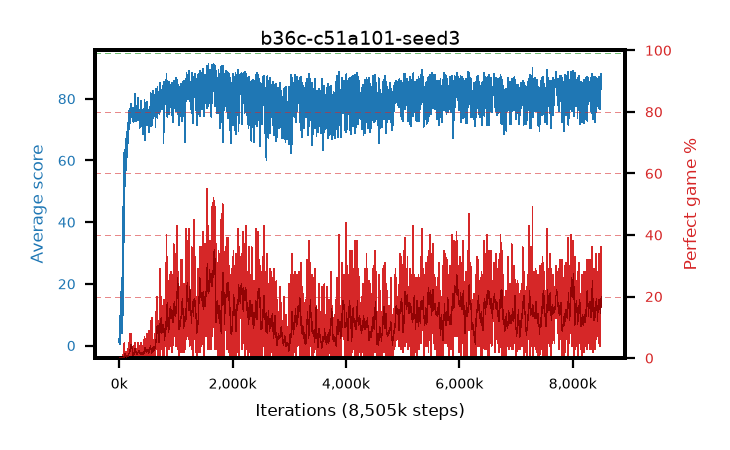

# b36c-c51a101-seed3

step **8,505,000** · 3402 evals · trailing **83.24** · peak **86.74** @1,682,500 · sef **0.0** · best30 **29.9** @1,685,000

## Config

| | |
|---|---|
| adam_epsilon | 0.0003125 |
| algo | c51 |
| batch_size | 32 |
| beta_anneal_steps | 300000 |
| collect_envs | 1 |
| discount | 0.99 |
| dist_atoms | 101 |
| dist_embedding | 64 |
| dist_fraction_entropy | 0.001 |
| dist_fraction_lr | 2.5e-09 |
| dist_kappa | 1.0 |
| dist_policy_samples | 32 |
| dist_quantiles | 32 |
| dist_risk_alpha | 1.0 |
| dist_risk_train | False |
| dist_tau_prime_samples | 64 |
| dist_tau_samples | 64 |
| dist_v_max | 110.0 |
| dist_v_min | -10.0 |
| epsilon_anneal_steps | 250000 |
| epsilon_schedule | linear |
| eval_interval | 2500 |
| eval_queue | True |
| eval_queue_depth | 16 |
| eval_workers | 8 |
| fc_layers | (320,) |
| fork_branches | 1 |
| gradient_clipping | 0.0 |
| graph_eval_episodes | 100 |
| guided_fraction | 0.0 |
| init_from | None |
| initial_collect_steps | 20000 |
| initial_epsilon | 1.0 |
| is_beta | 0.4 |
| is_beta_final | 1.0 |
| is_weights | False |
| learning_rate | 0.00025 |
| max_steps | 10000000 |
| min_checkpoint_score | 40.0 |
| min_epsilon | 0.01 |
| munchausen_alpha | 0.0 |
| munchausen_l0 | -1.0 |
| munchausen_tau | 0.03 |
| n_step_update | 1 |
| priority_exponent | 0.0 |
| replay_buffer_max_length | 1000000 |
| replay_ratio | 0.25 |
| seed | 3 |
| target_update_period | 2000 |
| target_update_tau | 1.0 |
| torch_threads | 1 |

## Evals

| step | avg score | trailing avg | min score | max score | avg reward | perfect % | epsilon |
|---|---|---|---|---|---|---|---|
| 2500 | 2.07 | 2.07 | 1.0 | 10.0 | 1.513 | 0.0 | 0.9901 |
| 5000 | 0.68 | 1.38 | 0.0 | 4.0 | 0.123 | 0.0 | 0.9802 |
| 7500 | 0.48 | 1.08 | 0.0 | 4.0 | -0.074 | 0.0 | 0.9703 |
| ... | ... | ... | ... | ... | ... | ... | ... |
| 8477500 | 83.49 | 82.37 | 27.0 | 95.0 | 96.249 | 14.0 | 0.01 |
| 8480000 | 86.75 | 82.4 | 59.0 | 95.0 | 113.443 | 28.0 | 0.01 |
| 8482500 | 76.66 | 82.17 | 33.0 | 95.0 | 80.498 | 5.0 | 0.01 |
| 8485000 | 77.67 | 82.19 | 27.0 | 95.0 | 80.493 | 4.0 | 0.01 |
| 8487500 | 87.09 | 82.5 | 67.0 | 95.0 | 109.802 | 24.0 | 0.01 |
| 8490000 | 81.46 | 82.3 | 45.0 | 95.0 | 96.101 | 16.0 | 0.01 |
| 8492500 | 84.42 | 82.59 | 61.0 | 95.0 | 100.04 | 17.0 | 0.01 |
| 8495000 | 87.34 | 83.01 | 55.0 | 95.0 | 114.013 | 28.0 | 0.01 |
| 8497500 | 88.12 | 82.87 | 31.0 | 95.0 | 122.756 | 36.0 | 0.01 |
| 8500000 | 84.42 | 83.14 | 51.0 | 95.0 | 101.144 | 18.0 | 0.01 |
| 8502500 | 85.62 | 82.46 | 51.0 | 95.0 | 107.357 | 23.0 | 0.01 |
| 8505000 | 86.27 | 83.24 | 51.0 | 95.0 | 107.97 | 23.0 | 0.01 |
