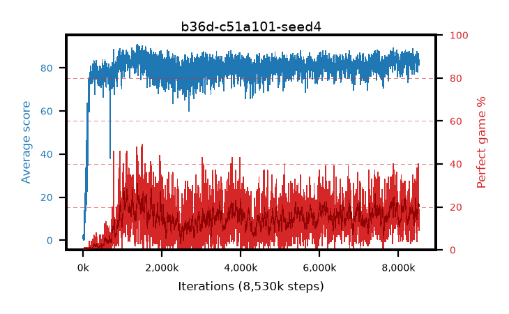

# b36d-c51a101-seed4

step **8,530,000** · 3409 evals · trailing **82.98** · peak **86.07** @1,432,500 · sef **0.0** · best30 **25.5** @1,422,500

## Config

| | |
|---|---|
| adam_epsilon | 0.0003125 |
| algo | c51 |
| batch_size | 32 |
| beta_anneal_steps | 300000 |
| collect_envs | 1 |
| discount | 0.99 |
| dist_atoms | 101 |
| dist_embedding | 64 |
| dist_fraction_entropy | 0.001 |
| dist_fraction_lr | 2.5e-09 |
| dist_kappa | 1.0 |
| dist_policy_samples | 32 |
| dist_quantiles | 32 |
| dist_risk_alpha | 1.0 |
| dist_risk_train | False |
| dist_tau_prime_samples | 64 |
| dist_tau_samples | 64 |
| dist_v_max | 110.0 |
| dist_v_min | -10.0 |
| epsilon_anneal_steps | 250000 |
| epsilon_schedule | linear |
| eval_interval | 2500 |
| eval_queue | True |
| eval_queue_depth | 16 |
| eval_workers | 8 |
| fc_layers | (320,) |
| fork_branches | 1 |
| gradient_clipping | 0.0 |
| graph_eval_episodes | 100 |
| guided_fraction | 0.0 |
| init_from | None |
| initial_collect_steps | 20000 |
| initial_epsilon | 1.0 |
| is_beta | 0.4 |
| is_beta_final | 1.0 |
| is_weights | False |
| learning_rate | 0.00025 |
| max_steps | 10000000 |
| min_checkpoint_score | 40.0 |
| min_epsilon | 0.01 |
| munchausen_alpha | 0.0 |
| munchausen_l0 | -1.0 |
| munchausen_tau | 0.03 |
| n_step_update | 1 |
| priority_exponent | 0.0 |
| replay_buffer_max_length | 1000000 |
| replay_ratio | 0.25 |
| seed | 4 |
| target_update_period | 2000 |
| target_update_tau | 1.0 |
| torch_threads | 1 |

## Evals

| step | avg score | trailing avg | min score | max score | avg reward | perfect % | epsilon |
|---|---|---|---|---|---|---|---|
| 2500 | 0.83 | 0.83 | 0.0 | 7.0 | 0.274 | 0.0 | 0.9901 |
| 5000 | 2.7 | 1.77 | 0.0 | 11.0 | 2.12 | 0.0 | 0.9802 |
| 7500 | 0.73 | 1.42 | 0.0 | 4.0 | 0.174 | 0.0 | 0.9703 |
| ... | ... | ... | ... | ... | ... | ... | ... |
| 8495000 | 84.34 | 83.1 | 18.0 | 95.0 | 99.841 | 18.0 | 0.01 |
| 8497500 | 84.41 | 83.08 | 16.0 | 95.0 | 103.287 | 22.0 | 0.01 |
| 8500000 | 85.71 | 82.69 | 16.0 | 95.0 | 123.826 | 40.0 | 0.01 |
| 8502500 | 85.04 | 82.79 | 17.0 | 95.0 | 106.968 | 24.0 | 0.01 |
| 8505000 | 86.71 | 82.73 | 49.0 | 95.0 | 107.019 | 22.0 | 0.01 |
| 8507500 | 82.56 | 82.71 | 46.0 | 95.0 | 95.0 | 14.0 | 0.01 |
| 8510000 | 81.61 | 82.8 | 14.0 | 95.0 | 100.829 | 21.0 | 0.01 |
| 8512500 | 84.68 | 82.85 | 41.0 | 95.0 | 97.489 | 15.0 | 0.01 |
| 8515000 | 85.62 | 82.95 | 55.0 | 95.0 | 106.791 | 23.0 | 0.01 |
| 8517500 | 82.94 | 82.9 | 22.0 | 95.0 | 97.466 | 17.0 | 0.01 |
| 8520000 | 83.77 | 83.03 | 47.0 | 95.0 | 97.502 | 16.0 | 0.01 |
| 8530000 | 81.48 | 82.98 | 29.0 | 95.0 | 88.491 | 9.0 | 0.01 |
