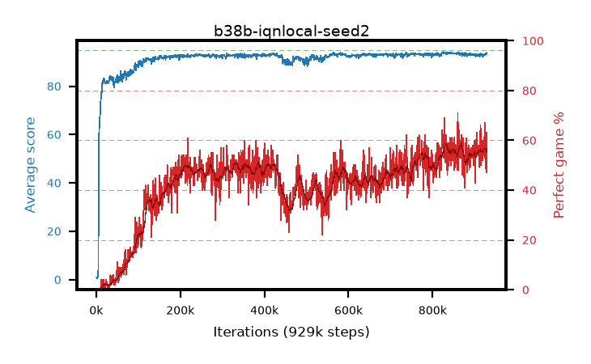

# b38b-iqnlocal-seed2

step **929,000** · 929 evals · trailing **92.96** · peak **93.71** @851,000 · sef **0.0** · best30 **56.6** @850,000

## Config

| | |
|---|---|
| adam_epsilon | 1e-07 |
| algo | iqn |
| batch_size | 128 |
| beta_anneal_steps | 300000 |
| collect_envs | 1 |
| discount | 0.99 |
| dist_atoms | 51 |
| dist_embedding | 64 |
| dist_fraction_entropy | 0.001 |
| dist_fraction_lr | 2.5e-09 |
| dist_kappa | 1.0 |
| dist_policy_samples | 32 |
| dist_quantiles | 32 |
| dist_risk_alpha | 1.0 |
| dist_risk_train | False |
| dist_tau_prime_samples | 8 |
| dist_tau_samples | 8 |
| dist_v_max | 110.0 |
| dist_v_min | -10.0 |
| epsilon_anneal_steps | 250000 |
| epsilon_schedule | eval |
| eval_interval | 1000 |
| eval_queue | True |
| eval_queue_depth | 16 |
| eval_workers | 8 |
| fc_layers | (320,) |
| fork_branches | 4 |
| fork_max_steps | 60 |
| fork_min_length | 85 |
| fork_prob | 0.5 |
| gradient_clipping | 0.0 |
| graph_eval_episodes | 100 |
| guided_fraction | 0.8 |
| init_from | None |
| initial_collect_steps | 2000 |
| initial_epsilon | 0.4 |
| is_beta | 0.4 |
| is_beta_final | 1.0 |
| is_weights | True |
| learning_rate | 1e-05 |
| max_steps | 2000000 |
| min_checkpoint_score | 40.0 |
| min_epsilon | 0.002 |
| munchausen_alpha | 0.0 |
| munchausen_l0 | -1.0 |
| munchausen_tau | 0.03 |
| n_step_update | 1 |
| priority_exponent | 0.6 |
| replay_buffer_max_length | 100000 |
| replay_ratio | 1.0 |
| seed | 2 |
| target_update_period | 8 |
| target_update_tau | 1.0 |
| torch_threads | 1 |

## Evals

| step | avg score | trailing avg | min score | max score | avg reward | perfect % | epsilon |
|---|---|---|---|---|---|---|---|
| 1000 | 0.67 | 0.67 | 0.0 | 3.0 | 0.118 | 0.0 | 0.4 |
| 2000 | 0.51 | 0.59 | 0.0 | 3.0 | -0.043 | 0.0 | 0.4 |
| 3000 | 1.0 | 0.73 | 0.0 | 5.0 | 0.445 | 0.0 | 0.4 |
| ... | ... | ... | ... | ... | ... | ... | ... |
| 918000 | 93.37 | 93.03 | 84.0 | 95.0 | 151.817 | 60.0 | 0.00356 |
| 919000 | 92.18 | 92.99 | 68.0 | 95.0 | 142.705 | 52.0 | 0.00355 |
| 920000 | 92.5 | 92.96 | 34.0 | 95.0 | 148.869 | 58.0 | 0.00354 |
| 921000 | 93.06 | 92.96 | 80.0 | 95.0 | 145.399 | 54.0 | 0.00353 |
| 922000 | 92.66 | 92.94 | 78.0 | 95.0 | 146.14 | 55.0 | 0.00352 |
| 923000 | 93.13 | 92.94 | 80.0 | 95.0 | 149.502 | 58.0 | 0.00353 |
| 924000 | 92.89 | 92.93 | 30.0 | 95.0 | 158.442 | 67.0 | 0.00352 |
| 925000 | 92.84 | 92.92 | 72.0 | 95.0 | 144.147 | 53.0 | 0.00352 |
| 926000 | 93.46 | 92.93 | 82.0 | 95.0 | 150.726 | 59.0 | 0.00348 |
| 927000 | 93.14 | 92.94 | 84.0 | 95.0 | 140.438 | 49.0 | 0.00349 |
| 928000 | 93.23 | 92.95 | 85.0 | 95.0 | 138.664 | 47.0 | 0.00348 |
| 929000 | 93.73 | 92.96 | 86.0 | 95.0 | 155.087 | 63.0 | 0.00349 |
