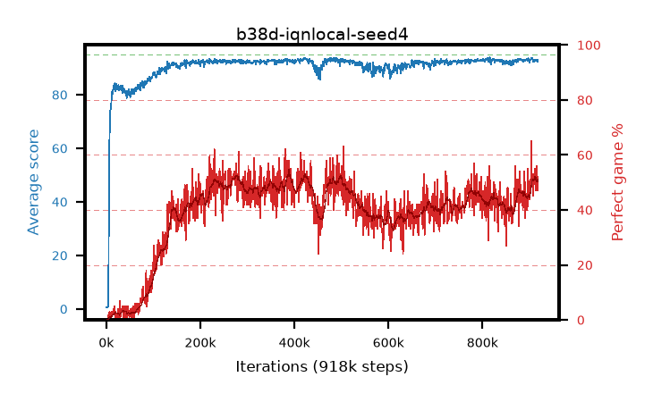

# b38d-iqnlocal-seed4

step **918,000** · 918 evals · trailing **92.95** · peak **93.02** @906,000 · sef **0.0** · best30 **51.1** @289,000

## Config

| | |
|---|---|
| adam_epsilon | 1e-07 |
| algo | iqn |
| batch_size | 128 |
| beta_anneal_steps | 300000 |
| collect_envs | 1 |
| discount | 0.99 |
| dist_atoms | 51 |
| dist_embedding | 64 |
| dist_fraction_entropy | 0.001 |
| dist_fraction_lr | 2.5e-09 |
| dist_kappa | 1.0 |
| dist_policy_samples | 32 |
| dist_quantiles | 32 |
| dist_risk_alpha | 1.0 |
| dist_risk_train | False |
| dist_tau_prime_samples | 8 |
| dist_tau_samples | 8 |
| dist_v_max | 110.0 |
| dist_v_min | -10.0 |
| epsilon_anneal_steps | 250000 |
| epsilon_schedule | eval |
| eval_interval | 1000 |
| eval_queue | True |
| eval_queue_depth | 16 |
| eval_workers | 8 |
| fc_layers | (320,) |
| fork_branches | 4 |
| fork_max_steps | 60 |
| fork_min_length | 85 |
| fork_prob | 0.5 |
| gradient_clipping | 0.0 |
| graph_eval_episodes | 100 |
| guided_fraction | 0.8 |
| init_from | None |
| initial_collect_steps | 2000 |
| initial_epsilon | 0.4 |
| is_beta | 0.4 |
| is_beta_final | 1.0 |
| is_weights | True |
| learning_rate | 1e-05 |
| max_steps | 2000000 |
| min_checkpoint_score | 40.0 |
| min_epsilon | 0.002 |
| munchausen_alpha | 0.0 |
| munchausen_l0 | -1.0 |
| munchausen_tau | 0.03 |
| n_step_update | 1 |
| priority_exponent | 0.6 |
| replay_buffer_max_length | 100000 |
| replay_ratio | 1.0 |
| seed | 4 |
| target_update_period | 8 |
| target_update_tau | 1.0 |
| torch_threads | 1 |

## Evals

| step | avg score | trailing avg | min score | max score | avg reward | perfect % | epsilon |
|---|---|---|---|---|---|---|---|
| 1000 | 0.69 | 0.69 | 0.0 | 5.0 | 0.136 | 0.0 | 0.4 |
| 2000 | 0.66 | 0.68 | 0.0 | 4.0 | 0.107 | 0.0 | 0.4 |
| 3000 | 0.59 | 0.65 | 0.0 | 5.0 | 0.037 | 0.0 | 0.4 |
| ... | ... | ... | ... | ... | ... | ... | ... |
| 907000 | 93.14 | 93.01 | 64.0 | 95.0 | 141.366 | 51.0 | 0.00427 |
| 908000 | 92.49 | 93.0 | 63.0 | 95.0 | 134.58 | 45.0 | 0.00426 |
| 909000 | 92.19 | 92.97 | 20.0 | 95.0 | 139.509 | 50.0 | 0.00426 |
| 910000 | 93.19 | 92.96 | 84.0 | 95.0 | 141.594 | 51.0 | 0.00422 |
| 911000 | 93.06 | 92.96 | 67.0 | 95.0 | 145.446 | 55.0 | 0.00422 |
| 912000 | 93.2 | 92.94 | 79.0 | 95.0 | 141.585 | 51.0 | 0.00423 |
| 913000 | 93.2 | 92.96 | 79.0 | 95.0 | 137.202 | 47.0 | 0.00419 |
| 914000 | 92.69 | 92.94 | 18.0 | 95.0 | 141.907 | 52.0 | 0.00418 |
| 915000 | 92.94 | 92.95 | 76.0 | 95.0 | 139.356 | 49.0 | 0.00418 |
| 916000 | 92.78 | 92.96 | 20.0 | 95.0 | 146.211 | 56.0 | 0.00415 |
| 917000 | 92.43 | 92.96 | 61.0 | 95.0 | 136.994 | 47.0 | 0.00414 |
| 918000 | 92.99 | 92.95 | 80.0 | 95.0 | 142.76 | 52.0 | 0.00409 |
