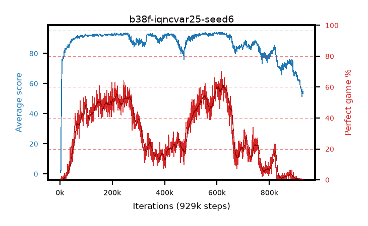

# b38f-iqncvar25-seed6

step **929,000** · 929 evals · trailing **60.37** · peak **93.45** @620,000 · sef **0.0** · best30 **59.6** @621,000

## Config

| | |
|---|---|
| adam_epsilon | 1e-07 |
| algo | iqn |
| batch_size | 128 |
| beta_anneal_steps | 300000 |
| collect_envs | 1 |
| discount | 0.99 |
| dist_atoms | 51 |
| dist_embedding | 64 |
| dist_fraction_entropy | 0.001 |
| dist_fraction_lr | 2.5e-09 |
| dist_kappa | 1.0 |
| dist_policy_samples | 32 |
| dist_quantiles | 32 |
| dist_risk_alpha | 0.25 |
| dist_risk_train | True |
| dist_tau_prime_samples | 8 |
| dist_tau_samples | 8 |
| dist_v_max | 110.0 |
| dist_v_min | -10.0 |
| epsilon_anneal_steps | 250000 |
| epsilon_schedule | eval |
| eval_interval | 1000 |
| eval_queue | True |
| eval_queue_depth | 16 |
| eval_workers | 8 |
| fc_layers | (320,) |
| fork_branches | 4 |
| fork_max_steps | 60 |
| fork_min_length | 85 |
| fork_prob | 0.5 |
| gradient_clipping | 0.0 |
| graph_eval_episodes | 100 |
| guided_fraction | 0.8 |
| init_from | None |
| initial_collect_steps | 2000 |
| initial_epsilon | 0.4 |
| is_beta | 0.4 |
| is_beta_final | 1.0 |
| is_weights | True |
| learning_rate | 1e-05 |
| max_steps | 2000000 |
| min_checkpoint_score | 40.0 |
| min_epsilon | 0.002 |
| munchausen_alpha | 0.0 |
| munchausen_l0 | -1.0 |
| munchausen_tau | 0.03 |
| n_step_update | 1 |
| priority_exponent | 0.6 |
| replay_buffer_max_length | 100000 |
| replay_ratio | 1.0 |
| seed | 6 |
| target_update_period | 8 |
| target_update_tau | 1.0 |
| torch_threads | 1 |

## Evals

| step | avg score | trailing avg | min score | max score | avg reward | perfect % | epsilon |
|---|---|---|---|---|---|---|---|
| 1000 | 1.22 | 1.22 | 0.0 | 7.0 | 0.657 | 0.0 | 0.4 |
| 2000 | 0.73 | 0.97 | 0.0 | 5.0 | 0.176 | 0.0 | 0.4 |
| 3000 | 2.26 | 1.4 | 0.0 | 12.0 | 1.696 | 0.0 | 0.4 |
| ... | ... | ... | ... | ... | ... | ... | ... |
| 918000 | 58.29 | 65.01 | 21.0 | 87.0 | 53.097 | 0.0 | 0.01226 |
| 919000 | 58.06 | 64.44 | 15.0 | 90.0 | 52.913 | 0.0 | 0.01227 |
| 920000 | 56.78 | 64.06 | 22.0 | 87.0 | 51.594 | 0.0 | 0.01229 |
| 921000 | 57.1 | 63.71 | 23.0 | 95.0 | 52.954 | 1.0 | 0.01232 |
| 922000 | 55.63 | 63.28 | 14.0 | 84.0 | 50.501 | 0.0 | 0.01232 |
| 923000 | 54.85 | 62.86 | 20.0 | 79.0 | 49.683 | 0.0 | 0.01232 |
| 924000 | 56.28 | 62.56 | 17.0 | 82.0 | 51.1 | 0.0 | 0.01237 |
| 925000 | 51.41 | 62.04 | 9.0 | 82.0 | 46.261 | 0.0 | 0.01237 |
| 926000 | 54.92 | 61.64 | 18.0 | 91.0 | 49.754 | 0.0 | 0.01238 |
| 927000 | 53.53 | 61.25 | 10.0 | 83.0 | 48.368 | 0.0 | 0.01238 |
| 928000 | 54.95 | 60.86 | 15.0 | 90.0 | 49.786 | 0.0 | 0.01239 |
| 929000 | 53.51 | 60.37 | 14.0 | 79.0 | 48.356 | 0.0 | 0.01239 |
