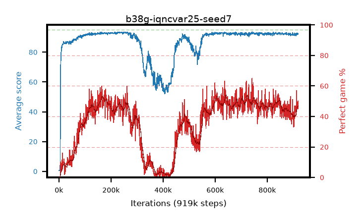

# b38g-iqncvar25-seed7

step **919,000** · 919 evals · trailing **91.92** · peak **93.13** @257,000 · sef **0.0** · best30 **51.6** @725,000

## Config

| | |
|---|---|
| adam_epsilon | 1e-07 |
| algo | iqn |
| batch_size | 128 |
| beta_anneal_steps | 300000 |
| collect_envs | 1 |
| discount | 0.99 |
| dist_atoms | 51 |
| dist_embedding | 64 |
| dist_fraction_entropy | 0.001 |
| dist_fraction_lr | 2.5e-09 |
| dist_kappa | 1.0 |
| dist_policy_samples | 32 |
| dist_quantiles | 32 |
| dist_risk_alpha | 0.25 |
| dist_risk_train | True |
| dist_tau_prime_samples | 8 |
| dist_tau_samples | 8 |
| dist_v_max | 110.0 |
| dist_v_min | -10.0 |
| epsilon_anneal_steps | 250000 |
| epsilon_schedule | eval |
| eval_interval | 1000 |
| eval_queue | True |
| eval_queue_depth | 16 |
| eval_workers | 8 |
| fc_layers | (320,) |
| fork_branches | 4 |
| fork_max_steps | 60 |
| fork_min_length | 85 |
| fork_prob | 0.5 |
| gradient_clipping | 0.0 |
| graph_eval_episodes | 100 |
| guided_fraction | 0.8 |
| init_from | None |
| initial_collect_steps | 2000 |
| initial_epsilon | 0.4 |
| is_beta | 0.4 |
| is_beta_final | 1.0 |
| is_weights | True |
| learning_rate | 1e-05 |
| max_steps | 2000000 |
| min_checkpoint_score | 40.0 |
| min_epsilon | 0.002 |
| munchausen_alpha | 0.0 |
| munchausen_l0 | -1.0 |
| munchausen_tau | 0.03 |
| n_step_update | 1 |
| priority_exponent | 0.6 |
| replay_buffer_max_length | 100000 |
| replay_ratio | 1.0 |
| seed | 7 |
| target_update_period | 8 |
| target_update_tau | 1.0 |
| torch_threads | 1 |

## Evals

| step | avg score | trailing avg | min score | max score | avg reward | perfect % | epsilon |
|---|---|---|---|---|---|---|---|
| 1000 | 0.56 | 0.56 | 0.0 | 3.0 | 0.006 | 0.0 | 0.4 |
| 2000 | 0.57 | 0.56 | 0.0 | 4.0 | 0.016 | 0.0 | 0.4 |
| 3000 | 0.65 | 0.59 | 0.0 | 4.0 | 0.097 | 0.0 | 0.4 |
| ... | ... | ... | ... | ... | ... | ... | ... |
| 908000 | 91.48 | 91.95 | 14.0 | 95.0 | 132.837 | 43.0 | 0.00481 |
| 909000 | 92.52 | 91.96 | 73.0 | 95.0 | 137.809 | 47.0 | 0.00482 |
| 910000 | 91.54 | 91.93 | 16.0 | 95.0 | 131.494 | 42.0 | 0.00483 |
| 911000 | 91.04 | 91.9 | 22.0 | 95.0 | 130.14 | 41.0 | 0.00484 |
| 912000 | 92.01 | 91.87 | 30.0 | 95.0 | 136.346 | 46.0 | 0.00483 |
| 913000 | 92.69 | 91.92 | 68.0 | 95.0 | 147.983 | 57.0 | 0.00484 |
| 914000 | 91.98 | 91.91 | 46.0 | 95.0 | 137.401 | 47.0 | 0.00485 |
| 915000 | 91.82 | 91.92 | 38.0 | 95.0 | 138.136 | 48.0 | 0.00478 |
| 916000 | 92.85 | 91.94 | 82.0 | 95.0 | 138.221 | 47.0 | 0.00476 |
| 917000 | 92.68 | 91.93 | 62.0 | 95.0 | 135.925 | 45.0 | 0.00473 |
| 918000 | 91.96 | 91.93 | 44.0 | 95.0 | 135.214 | 45.0 | 0.0047 |
| 919000 | 92.39 | 91.92 | 74.0 | 95.0 | 140.34 | 50.0 | 0.0047 |
