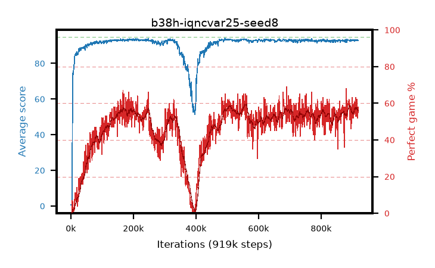

# b38h-iqncvar25-seed8

step **919,000** · 919 evals · trailing **92.95** · peak **93.39** @213,000 · sef **0.0** · best30 **57.5** @511,000

## Config

| | |
|---|---|
| adam_epsilon | 1e-07 |
| algo | iqn |
| batch_size | 128 |
| beta_anneal_steps | 300000 |
| collect_envs | 1 |
| discount | 0.99 |
| dist_atoms | 51 |
| dist_embedding | 64 |
| dist_fraction_entropy | 0.001 |
| dist_fraction_lr | 2.5e-09 |
| dist_kappa | 1.0 |
| dist_policy_samples | 32 |
| dist_quantiles | 32 |
| dist_risk_alpha | 0.25 |
| dist_risk_train | True |
| dist_tau_prime_samples | 8 |
| dist_tau_samples | 8 |
| dist_v_max | 110.0 |
| dist_v_min | -10.0 |
| epsilon_anneal_steps | 250000 |
| epsilon_schedule | eval |
| eval_interval | 1000 |
| eval_queue | True |
| eval_queue_depth | 16 |
| eval_workers | 8 |
| fc_layers | (320,) |
| fork_branches | 4 |
| fork_max_steps | 60 |
| fork_min_length | 85 |
| fork_prob | 0.5 |
| gradient_clipping | 0.0 |
| graph_eval_episodes | 100 |
| guided_fraction | 0.8 |
| init_from | None |
| initial_collect_steps | 2000 |
| initial_epsilon | 0.4 |
| is_beta | 0.4 |
| is_beta_final | 1.0 |
| is_weights | True |
| learning_rate | 1e-05 |
| max_steps | 2000000 |
| min_checkpoint_score | 40.0 |
| min_epsilon | 0.002 |
| munchausen_alpha | 0.0 |
| munchausen_l0 | -1.0 |
| munchausen_tau | 0.03 |
| n_step_update | 1 |
| priority_exponent | 0.6 |
| replay_buffer_max_length | 100000 |
| replay_ratio | 1.0 |
| seed | 8 |
| target_update_period | 8 |
| target_update_tau | 1.0 |
| torch_threads | 1 |

## Evals

| step | avg score | trailing avg | min score | max score | avg reward | perfect % | epsilon |
|---|---|---|---|---|---|---|---|
| 1000 | 0.66 | 0.66 | 0.0 | 4.0 | 0.107 | 0.0 | 0.4 |
| 2000 | 0.62 | 0.64 | 0.0 | 5.0 | 0.067 | 0.0 | 0.4 |
| 3000 | 0.75 | 0.68 | 0.0 | 4.0 | 0.196 | 0.0 | 0.4 |
| ... | ... | ... | ... | ... | ... | ... | ... |
| 908000 | 93.27 | 92.92 | 82.0 | 95.0 | 151.256 | 60.0 | 0.00343 |
| 909000 | 92.82 | 92.95 | 72.0 | 95.0 | 148.023 | 57.0 | 0.00343 |
| 910000 | 92.7 | 92.95 | 70.0 | 95.0 | 143.356 | 53.0 | 0.00341 |
| 911000 | 93.36 | 92.94 | 78.0 | 95.0 | 154.412 | 63.0 | 0.0034 |
| 912000 | 93.28 | 92.98 | 70.0 | 95.0 | 144.261 | 53.0 | 0.00341 |
| 913000 | 92.83 | 92.98 | 60.0 | 95.0 | 146.718 | 56.0 | 0.00342 |
| 914000 | 92.93 | 92.98 | 76.0 | 95.0 | 145.029 | 54.0 | 0.00342 |
| 915000 | 93.21 | 92.97 | 68.0 | 95.0 | 153.343 | 62.0 | 0.00341 |
| 916000 | 92.84 | 92.96 | 56.0 | 95.0 | 142.853 | 52.0 | 0.00341 |
| 917000 | 93.17 | 92.96 | 82.0 | 95.0 | 142.925 | 52.0 | 0.0034 |
| 918000 | 92.95 | 92.96 | 72.0 | 95.0 | 148.648 | 58.0 | 0.00342 |
| 919000 | 92.8 | 92.95 | 72.0 | 95.0 | 145.852 | 55.0 | 0.00344 |
