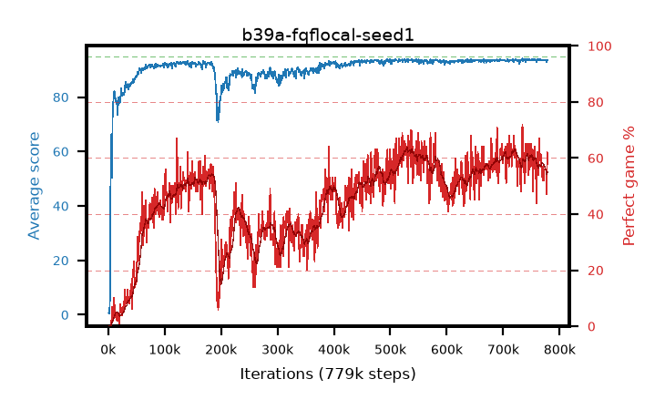

# b39a-fqflocal-seed1

step **779,000** · 779 evals · trailing **93.6** · peak **93.66** @766,000 · sef **0.0** · best30 **62.3** @550,000

## Config

| | |
|---|---|
| adam_epsilon | 1e-07 |
| algo | fqf |
| batch_size | 128 |
| beta_anneal_steps | 300000 |
| collect_envs | 1 |
| discount | 0.99 |
| dist_atoms | 51 |
| dist_embedding | 64 |
| dist_fraction_entropy | 0.001 |
| dist_fraction_lr | 2.5e-09 |
| dist_kappa | 1.0 |
| dist_policy_samples | 32 |
| dist_quantiles | 8 |
| dist_risk_alpha | 1.0 |
| dist_risk_train | False |
| dist_tau_prime_samples | 64 |
| dist_tau_samples | 64 |
| dist_v_max | 110.0 |
| dist_v_min | -10.0 |
| epsilon_anneal_steps | 250000 |
| epsilon_schedule | eval |
| eval_interval | 1000 |
| eval_queue | True |
| eval_queue_depth | 16 |
| eval_workers | 8 |
| fc_layers | (320,) |
| fork_branches | 4 |
| fork_max_steps | 60 |
| fork_min_length | 85 |
| fork_prob | 0.5 |
| gradient_clipping | 0.0 |
| graph_eval_episodes | 100 |
| guided_fraction | 0.8 |
| init_from | None |
| initial_collect_steps | 2000 |
| initial_epsilon | 0.4 |
| is_beta | 0.4 |
| is_beta_final | 1.0 |
| is_weights | True |
| learning_rate | 1e-05 |
| max_steps | 2000000 |
| min_checkpoint_score | 40.0 |
| min_epsilon | 0.002 |
| munchausen_alpha | 0.0 |
| munchausen_l0 | -1.0 |
| munchausen_tau | 0.03 |
| n_step_update | 1 |
| priority_exponent | 0.6 |
| replay_buffer_max_length | 100000 |
| replay_ratio | 1.0 |
| seed | 1 |
| target_update_period | 8 |
| target_update_tau | 1.0 |
| torch_threads | 1 |

## Evals

| step | avg score | trailing avg | min score | max score | avg reward | perfect % | epsilon |
|---|---|---|---|---|---|---|---|
| 1000 | 0.71 | 0.71 | 0.0 | 5.0 | 0.157 | 0.0 | 0.4 |
| 2000 | 0.46 | 0.58 | 0.0 | 3.0 | -0.093 | 0.0 | 0.4 |
| 3000 | 3.54 | 1.57 | 1.0 | 13.0 | 2.981 | 0.0 | 0.4 |
| ... | ... | ... | ... | ... | ... | ... | ... |
| 768000 | 93.53 | 93.65 | 82.0 | 95.0 | 147.193 | 56.0 | 0.00323 |
| 769000 | 93.42 | 93.63 | 80.0 | 95.0 | 145.077 | 54.0 | 0.00323 |
| 770000 | 93.45 | 93.65 | 86.0 | 95.0 | 143.264 | 52.0 | 0.00321 |
| 771000 | 93.71 | 93.65 | 86.0 | 95.0 | 148.325 | 57.0 | 0.00324 |
| 772000 | 93.44 | 93.64 | 86.0 | 95.0 | 143.203 | 52.0 | 0.00325 |
| 773000 | 93.53 | 93.63 | 86.0 | 95.0 | 147.475 | 56.0 | 0.00327 |
| 774000 | 93.57 | 93.62 | 86.0 | 95.0 | 147.379 | 56.0 | 0.00329 |
| 775000 | 93.68 | 93.62 | 84.0 | 95.0 | 147.427 | 56.0 | 0.00331 |
| 776000 | 93.49 | 93.61 | 82.0 | 95.0 | 147.137 | 56.0 | 0.00333 |
| 777000 | 92.83 | 93.59 | 24.0 | 95.0 | 137.352 | 47.0 | 0.00332 |
| 778000 | 93.62 | 93.59 | 76.0 | 95.0 | 153.617 | 62.0 | 0.00335 |
| 779000 | 93.68 | 93.6 | 86.0 | 95.0 | 149.523 | 58.0 | 0.00337 |
