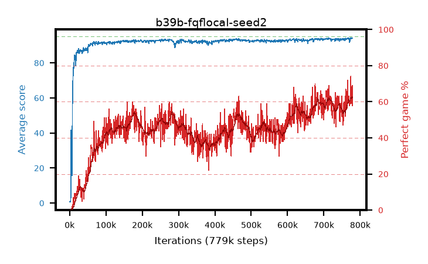

# b39b-fqflocal-seed2

step **779,000** · 779 evals · trailing **93.69** · peak **93.69** @779,000 · sef **0.0** · best30 **60.1** @719,000

## Config

| | |
|---|---|
| adam_epsilon | 1e-07 |
| algo | fqf |
| batch_size | 128 |
| beta_anneal_steps | 300000 |
| collect_envs | 1 |
| discount | 0.99 |
| dist_atoms | 51 |
| dist_embedding | 64 |
| dist_fraction_entropy | 0.001 |
| dist_fraction_lr | 2.5e-09 |
| dist_kappa | 1.0 |
| dist_policy_samples | 32 |
| dist_quantiles | 8 |
| dist_risk_alpha | 1.0 |
| dist_risk_train | False |
| dist_tau_prime_samples | 64 |
| dist_tau_samples | 64 |
| dist_v_max | 110.0 |
| dist_v_min | -10.0 |
| epsilon_anneal_steps | 250000 |
| epsilon_schedule | eval |
| eval_interval | 1000 |
| eval_queue | True |
| eval_queue_depth | 16 |
| eval_workers | 8 |
| fc_layers | (320,) |
| fork_branches | 4 |
| fork_max_steps | 60 |
| fork_min_length | 85 |
| fork_prob | 0.5 |
| gradient_clipping | 0.0 |
| graph_eval_episodes | 100 |
| guided_fraction | 0.8 |
| init_from | None |
| initial_collect_steps | 2000 |
| initial_epsilon | 0.4 |
| is_beta | 0.4 |
| is_beta_final | 1.0 |
| is_weights | True |
| learning_rate | 1e-05 |
| max_steps | 2000000 |
| min_checkpoint_score | 40.0 |
| min_epsilon | 0.002 |
| munchausen_alpha | 0.0 |
| munchausen_l0 | -1.0 |
| munchausen_tau | 0.03 |
| n_step_update | 1 |
| priority_exponent | 0.6 |
| replay_buffer_max_length | 100000 |
| replay_ratio | 1.0 |
| seed | 2 |
| target_update_period | 8 |
| target_update_tau | 1.0 |
| torch_threads | 1 |

## Evals

| step | avg score | trailing avg | min score | max score | avg reward | perfect % | epsilon |
|---|---|---|---|---|---|---|---|
| 1000 | 0.68 | 0.68 | 0.0 | 5.0 | 0.127 | 0.0 | 0.4 |
| 2000 | 0.72 | 0.7 | 0.0 | 5.0 | 0.165 | 0.0 | 0.4 |
| 3000 | 1.36 | 0.92 | 0.0 | 12.0 | 0.804 | 0.0 | 0.4 |
| ... | ... | ... | ... | ... | ... | ... | ... |
| 768000 | 93.62 | 93.5 | 70.0 | 95.0 | 155.113 | 63.0 | 0.00339 |
| 769000 | 94.04 | 93.54 | 84.0 | 95.0 | 155.376 | 63.0 | 0.00338 |
| 770000 | 93.96 | 93.57 | 87.0 | 95.0 | 150.429 | 58.0 | 0.00338 |
| 771000 | 91.74 | 93.51 | 2.0 | 95.0 | 148.187 | 58.0 | 0.00338 |
| 772000 | 93.73 | 93.5 | 86.0 | 95.0 | 152.182 | 60.0 | 0.00338 |
| 773000 | 93.74 | 93.54 | 80.0 | 95.0 | 151.068 | 59.0 | 0.00338 |
| 774000 | 94.38 | 93.58 | 90.0 | 95.0 | 166.735 | 74.0 | 0.00339 |
| 775000 | 93.86 | 93.61 | 76.0 | 95.0 | 156.167 | 64.0 | 0.00337 |
| 776000 | 94.06 | 93.61 | 86.0 | 95.0 | 155.24 | 63.0 | 0.0033 |
| 777000 | 93.96 | 93.65 | 86.0 | 95.0 | 151.22 | 59.0 | 0.00327 |
| 778000 | 94.14 | 93.67 | 82.0 | 95.0 | 161.38 | 69.0 | 0.00326 |
| 779000 | 94.03 | 93.69 | 88.0 | 95.0 | 150.213 | 58.0 | 0.00325 |
