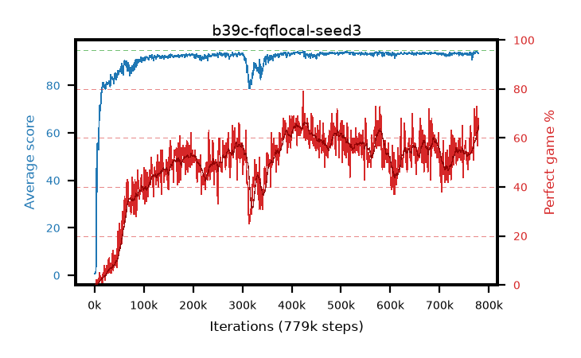

# b39c-fqflocal-seed3

step **779,000** · 779 evals · trailing **93.41** · peak **93.73** @526,000 · sef **0.0** · best30 **65.2** @428,000

## Config

| | |
|---|---|
| adam_epsilon | 1e-07 |
| algo | fqf |
| batch_size | 128 |
| beta_anneal_steps | 300000 |
| collect_envs | 1 |
| discount | 0.99 |
| dist_atoms | 51 |
| dist_embedding | 64 |
| dist_fraction_entropy | 0.001 |
| dist_fraction_lr | 2.5e-09 |
| dist_kappa | 1.0 |
| dist_policy_samples | 32 |
| dist_quantiles | 8 |
| dist_risk_alpha | 1.0 |
| dist_risk_train | False |
| dist_tau_prime_samples | 64 |
| dist_tau_samples | 64 |
| dist_v_max | 110.0 |
| dist_v_min | -10.0 |
| epsilon_anneal_steps | 250000 |
| epsilon_schedule | eval |
| eval_interval | 1000 |
| eval_queue | True |
| eval_queue_depth | 16 |
| eval_workers | 8 |
| fc_layers | (320,) |
| fork_branches | 4 |
| fork_max_steps | 60 |
| fork_min_length | 85 |
| fork_prob | 0.5 |
| gradient_clipping | 0.0 |
| graph_eval_episodes | 100 |
| guided_fraction | 0.8 |
| init_from | None |
| initial_collect_steps | 2000 |
| initial_epsilon | 0.4 |
| is_beta | 0.4 |
| is_beta_final | 1.0 |
| is_weights | True |
| learning_rate | 1e-05 |
| max_steps | 2000000 |
| min_checkpoint_score | 40.0 |
| min_epsilon | 0.002 |
| munchausen_alpha | 0.0 |
| munchausen_l0 | -1.0 |
| munchausen_tau | 0.03 |
| n_step_update | 1 |
| priority_exponent | 0.6 |
| replay_buffer_max_length | 100000 |
| replay_ratio | 1.0 |
| seed | 3 |
| target_update_period | 8 |
| target_update_tau | 1.0 |
| torch_threads | 1 |

## Evals

| step | avg score | trailing avg | min score | max score | avg reward | perfect % | epsilon |
|---|---|---|---|---|---|---|---|
| 1000 | 0.66 | 0.66 | 0.0 | 4.0 | 0.106 | 0.0 | 0.4 |
| 2000 | 0.97 | 0.81 | 0.0 | 5.0 | 0.413 | 0.0 | 0.4 |
| 3000 | 1.83 | 1.15 | 0.0 | 12.0 | 1.272 | 0.0 | 0.4 |
| ... | ... | ... | ... | ... | ... | ... | ... |
| 768000 | 93.84 | 93.2 | 85.0 | 95.0 | 148.275 | 57.0 | 0.00359 |
| 769000 | 93.07 | 93.22 | 55.0 | 95.0 | 141.434 | 51.0 | 0.00358 |
| 770000 | 94.08 | 93.24 | 68.0 | 95.0 | 163.774 | 72.0 | 0.00358 |
| 771000 | 93.75 | 93.23 | 78.0 | 95.0 | 156.562 | 65.0 | 0.0036 |
| 772000 | 93.49 | 93.24 | 75.0 | 95.0 | 152.187 | 61.0 | 0.00355 |
| 773000 | 94.18 | 93.26 | 87.0 | 95.0 | 154.653 | 63.0 | 0.00354 |
| 774000 | 94.12 | 93.31 | 85.0 | 95.0 | 158.848 | 67.0 | 0.00352 |
| 775000 | 94.07 | 93.32 | 76.0 | 95.0 | 164.966 | 73.0 | 0.00348 |
| 776000 | 94.08 | 93.34 | 86.0 | 95.0 | 152.513 | 61.0 | 0.00345 |
| 777000 | 93.94 | 93.38 | 74.0 | 95.0 | 148.086 | 57.0 | 0.0034 |
| 778000 | 93.65 | 93.4 | 77.0 | 95.0 | 156.084 | 65.0 | 0.00341 |
| 779000 | 93.45 | 93.41 | 68.0 | 95.0 | 159.315 | 68.0 | 0.00339 |
