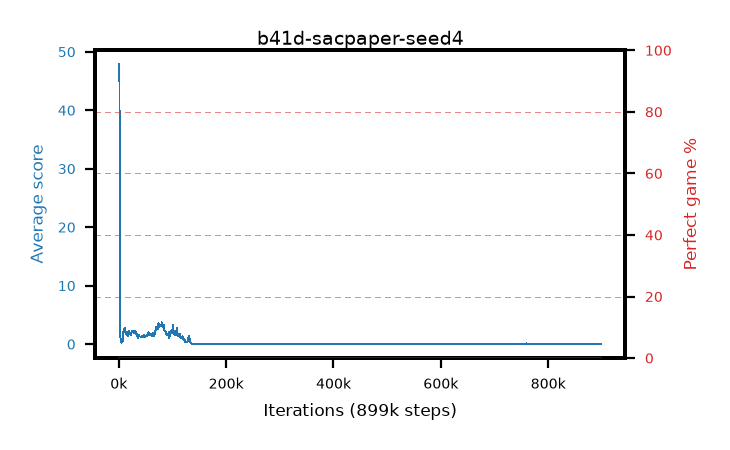

# b41d-sacpaper-seed4

step **899,000** · 899 evals · trailing **0.05** · peak **16.49** @1,000 · sef **0.0** · best30 **0.0** @899,000

**Below threshold since step 136,000** — 763,000 steps ago. Not a verdict; arms have recovered from longer.

## Config

| | |
|---|---|
| algo | sac |
| collect_envs | 16 |
| discount | 0.99 |
| eval_interval | 1000 |
| eval_queue | True |
| eval_queue_depth | 16 |
| eval_workers | 8 |
| fc_layers | (320,) |
| graph_eval_episodes | 100 |
| init_from | None |
| max_steps | 3125000 |
| min_checkpoint_score | 40.0 |
| sac_adam_epsilon | 1e-08 |
| sac_alpha | auto |
| sac_alpha_learning_rate | 0.0003 |
| sac_batch_size | 64 |
| sac_critic_combine | min |
| sac_critic_learning_rate | 0.0003 |
| sac_entropy_penalty | 0.0 |
| sac_init_alpha | 1.0 |
| sac_learning_rate | 0.0003 |
| sac_n_step | 1 |
| sac_prefill | 20000 |
| sac_priority_exponent | 0.0 |
| sac_q_clip | 0.0 |
| sac_replay_buffer_max_length | 1000000 |
| sac_replay_ratio | 0.25 |
| sac_target_entropy | 1.07664 |
| sac_target_entropy_ratio | 0.98 |
| sac_target_update_period | 2000 |
| sac_tau | 1.0 |
| seed | 4 |
| torch_threads | 1 |

## Evals

| step | avg score | trailing avg | min score | max score | avg reward | perfect % | epsilon |
|---|---|---|---|---|---|---|---|
| 1000 | 47.86 | 16.49 | 0.0 | 85.0 | 45.276 | 0.0 |  |
| 2000 | 31.65 | 16.28 | 2.0 | 77.0 | 28.768 | 0.0 |  |
| 3000 | 1.24 | 1.24 | 0.0 | 10.0 | 0.68 | 0.0 |  |
| ... | ... | ... | ... | ... | ... | ... | ... |
| 888000 | 0.09 | 0.05 | 0.0 | 2.0 | -4.913 | 0.0 |  |
| 889000 | 0.04 | 0.05 | 0.0 | 1.0 | -4.963 | 0.0 |  |
| 890000 | 0.04 | 0.05 | 0.0 | 1.0 | -4.963 | 0.0 |  |
| 891000 | 0.07 | 0.05 | 0.0 | 2.0 | -4.933 | 0.0 |  |
| 892000 | 0.05 | 0.05 | 0.0 | 1.0 | -4.953 | 0.0 |  |
| 893000 | 0.07 | 0.05 | 0.0 | 1.0 | -4.933 | 0.0 |  |
| 894000 | 0.05 | 0.05 | 0.0 | 1.0 | -4.953 | 0.0 |  |
| 895000 | 0.01 | 0.05 | 0.0 | 1.0 | -4.993 | 0.0 |  |
| 896000 | 0.04 | 0.05 | 0.0 | 1.0 | -4.963 | 0.0 |  |
| 897000 | 0.1 | 0.05 | 0.0 | 1.0 | -4.903 | 0.0 |  |
| 898000 | 0.05 | 0.05 | 0.0 | 1.0 | -4.953 | 0.0 |  |
| 899000 | 0.04 | 0.05 | 0.0 | 1.0 | -4.963 | 0.0 |  |
