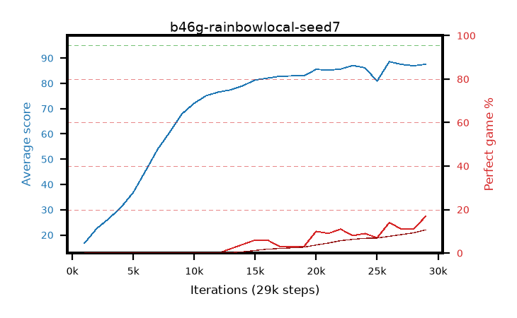

# b46g-rainbowlocal-seed7

step **29,000** · 29 evals · trailing **69.49** · peak **69.49** @29,000 · sef **0.0** · best30 **0.0** @29,000

## Config

| | |
|---|---|
| adam_epsilon | 1e-07 |
| algo | rainbow |
| batch_size | 128 |
| beta_anneal_steps | 300000 |
| btr_blocks | 3 |
| btr_layer_norm | False |
| btr_residual | False |
| btr_spectral_norm | True |
| collect_envs | 1 |
| discount | 0.99 |
| dist_atoms | 51 |
| dist_embedding | 64 |
| dist_kappa | 1.0 |
| dist_policy_samples | 8 |
| dist_quantiles | 32 |
| dist_tau_prime_samples | 8 |
| dist_tau_samples | 8 |
| dist_v_max | 110.0 |
| dist_v_min | -10.0 |
| epsilon_anneal_steps | 1 |
| epsilon_schedule | eval |
| eval_interval | 1000 |
| eval_queue | True |
| eval_queue_depth | 16 |
| eval_workers | 8 |
| fc_layers | (320,) |
| fork_branches | 4 |
| fork_max_steps | 60 |
| fork_min_length | 85 |
| fork_prob | 0.5 |
| gradient_clipping | 0.0 |
| graph_eval_episodes | 100 |
| guided_fraction | 0.8 |
| init_from | None |
| initial_collect_steps | 2000 |
| initial_epsilon | 0.4 |
| is_beta | 0.4 |
| is_beta_final | 1.0 |
| is_normalization | mean |
| is_weights | True |
| learning_rate | 1e-05 |
| max_steps | 3000000 |
| min_checkpoint_score | 40.0 |
| min_epsilon | 0.002 |
| munchausen_alpha | 0.0 |
| munchausen_l0 | -1.0 |
| munchausen_tau | 0.03 |
| n_step_update | 3 |
| priority_exponent | 0.6 |
| rainbow_double | True |
| rainbow_dueling | True |
| rainbow_epsilon_decay | linear |
| rainbow_epsilon_zero_at | 0.0 |
| rainbow_head | c51 |
| rainbow_munchausen_logpi | target |
| rainbow_noisy | True |
| rainbow_noisy_sigma | 0.5 |
| rainbow_prefill_epsilon | random |
| rainbow_stream_width | 512 |
| replay_buffer_max_length | 100000 |
| replay_ratio | 1.0 |
| reset_alpha | 0.5 |
| reset_anneal_gamma |  |
| reset_anneal_n_step |  |
| reset_anneal_steps | 10000 |
| reset_interval | 0 |
| reset_stop_after | 0 |
| seed | 7 |
| target_update_period | 8 |
| target_update_tau | 1.0 |
| torch_threads | 1 |

## Evals

| step | avg score | trailing avg | min score | max score | avg reward | perfect % | epsilon |
|---|---|---|---|---|---|---|---|
| 1000 | 16.76 | 16.76 | 0.0 | 39.0 | 11.915 | 0.0 | 0.4 |
| 2000 | 22.55 | 19.66 | 0.0 | 39.0 | 17.565 | 0.0 | 0.4 |
| 3000 | 26.49 | 21.93 | 5.0 | 45.0 | 21.492 | 0.0 | 0.05 |
| ... | ... | ... | ... | ... | ... | ... | ... |
| 18000 | 82.95 | 59.5 | 32.0 | 95.0 | 84.15 | 3.0 | 0.01218 |
| 19000 | 82.99 | 60.74 | 1.0 | 95.0 | 84.002 | 3.0 | 0.01215 |
| 20000 | 85.53 | 61.98 | 0.0 | 95.0 | 93.814 | 10.0 | 0.01212 |
| 21000 | 85.25 | 63.09 | 2.0 | 95.0 | 92.446 | 9.0 | 0.0121 |
| 22000 | 85.64 | 64.11 | 1.0 | 95.0 | 94.732 | 11.0 | 0.01198 |
| 23000 | 87.07 | 65.11 | 60.0 | 95.0 | 93.226 | 8.0 | 0.01189 |
| 24000 | 86.17 | 65.99 | 0.0 | 95.0 | 93.51 | 9.0 | 0.01178 |
| 25000 | 80.89 | 66.58 | 0.0 | 95.0 | 86.253 | 7.0 | 0.01172 |
| 26000 | 88.59 | 67.43 | 70.0 | 95.0 | 100.773 | 14.0 | 0.01165 |
| 27000 | 87.49 | 68.17 | 60.0 | 95.0 | 96.81 | 11.0 | 0.01161 |
| 28000 | 86.97 | 68.84 | 3.0 | 95.0 | 96.282 | 11.0 | 0.0115 |
| 29000 | 87.57 | 69.49 | 53.0 | 95.0 | 102.951 | 17.0 | 0.01142 |
