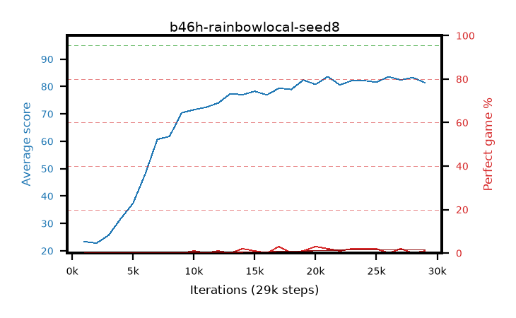

# b46h-rainbowlocal-seed8

step **29,000** · 29 evals · trailing **67.99** · peak **67.99** @29,000 · sef **0.0** · best30 **0.0** @29,000

## Config

| | |
|---|---|
| adam_epsilon | 1e-07 |
| algo | rainbow |
| batch_size | 128 |
| beta_anneal_steps | 300000 |
| btr_blocks | 3 |
| btr_layer_norm | False |
| btr_residual | False |
| btr_spectral_norm | True |
| collect_envs | 1 |
| discount | 0.99 |
| dist_atoms | 51 |
| dist_embedding | 64 |
| dist_kappa | 1.0 |
| dist_policy_samples | 8 |
| dist_quantiles | 32 |
| dist_tau_prime_samples | 8 |
| dist_tau_samples | 8 |
| dist_v_max | 110.0 |
| dist_v_min | -10.0 |
| epsilon_anneal_steps | 1 |
| epsilon_schedule | eval |
| eval_interval | 1000 |
| eval_queue | True |
| eval_queue_depth | 16 |
| eval_workers | 8 |
| fc_layers | (320,) |
| fork_branches | 4 |
| fork_max_steps | 60 |
| fork_min_length | 85 |
| fork_prob | 0.5 |
| gradient_clipping | 0.0 |
| graph_eval_episodes | 100 |
| guided_fraction | 0.8 |
| init_from | None |
| initial_collect_steps | 2000 |
| initial_epsilon | 0.4 |
| is_beta | 0.4 |
| is_beta_final | 1.0 |
| is_normalization | mean |
| is_weights | True |
| learning_rate | 1e-05 |
| max_steps | 3000000 |
| min_checkpoint_score | 40.0 |
| min_epsilon | 0.002 |
| munchausen_alpha | 0.0 |
| munchausen_l0 | -1.0 |
| munchausen_tau | 0.03 |
| n_step_update | 3 |
| priority_exponent | 0.6 |
| rainbow_double | True |
| rainbow_dueling | True |
| rainbow_epsilon_decay | linear |
| rainbow_epsilon_zero_at | 0.0 |
| rainbow_head | c51 |
| rainbow_munchausen_logpi | target |
| rainbow_noisy | True |
| rainbow_noisy_sigma | 0.5 |
| rainbow_prefill_epsilon | random |
| rainbow_stream_width | 512 |
| replay_buffer_max_length | 100000 |
| replay_ratio | 1.0 |
| reset_alpha | 0.5 |
| reset_anneal_gamma |  |
| reset_anneal_n_step |  |
| reset_anneal_steps | 10000 |
| reset_interval | 0 |
| reset_stop_after | 0 |
| seed | 8 |
| target_update_period | 8 |
| target_update_tau | 1.0 |
| torch_threads | 1 |

## Evals

| step | avg score | trailing avg | min score | max score | avg reward | perfect % | epsilon |
|---|---|---|---|---|---|---|---|
| 1000 | 23.36 | 23.36 | 0.0 | 43.0 | 18.455 | 0.0 | 0.4 |
| 2000 | 22.79 | 23.07 | 6.0 | 44.0 | 17.76 | 0.0 | 0.4 |
| 3000 | 25.71 | 23.95 | 4.0 | 51.0 | 20.669 | 0.0 | 0.025 |
| ... | ... | ... | ... | ... | ... | ... | ... |
| 18000 | 78.92 | 59.32 | 0.0 | 93.0 | 77.313 | 0.0 | 0.01241 |
| 19000 | 82.38 | 60.53 | 1.0 | 95.0 | 81.828 | 1.0 | 0.01237 |
| 20000 | 80.75 | 61.54 | 0.0 | 95.0 | 82.233 | 3.0 | 0.01237 |
| 21000 | 83.62 | 62.59 | 60.0 | 95.0 | 84.069 | 2.0 | 0.01237 |
| 22000 | 80.59 | 63.41 | 0.0 | 95.0 | 80.104 | 1.0 | 0.01233 |
| 23000 | 82.17 | 64.23 | 0.0 | 95.0 | 82.661 | 2.0 | 0.01231 |
| 24000 | 82.15 | 64.97 | 1.0 | 95.0 | 82.687 | 2.0 | 0.01231 |
| 25000 | 81.59 | 65.64 | 0.0 | 95.0 | 82.052 | 2.0 | 0.01229 |
| 26000 | 83.55 | 66.33 | 65.0 | 93.0 | 81.983 | 0.0 | 0.01228 |
| 27000 | 82.41 | 66.92 | 0.0 | 95.0 | 82.85 | 2.0 | 0.01226 |
| 28000 | 83.27 | 67.51 | 0.0 | 93.0 | 81.784 | 0.0 | 0.01227 |
| 29000 | 81.39 | 67.99 | 0.0 | 95.0 | 80.964 | 1.0 | 0.01226 |
