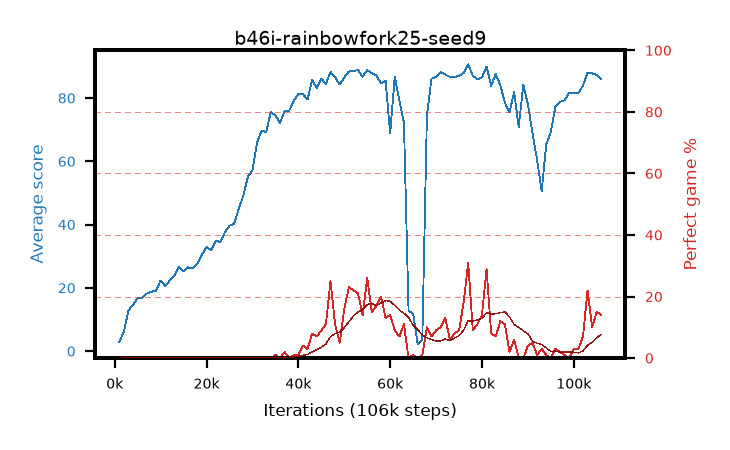

# b46i-rainbowfork25-seed9

step **106,000** · 106 evals · trailing **79.77** · peak **82.45** @62,000 · sef **0.0** · best30 **12.5** @81,000

## Config

| | |
|---|---|
| adam_epsilon | 1e-07 |
| algo | rainbow |
| batch_size | 32 |
| beta_anneal_steps | 300000 |
| btr_blocks | 3 |
| btr_layer_norm | False |
| btr_residual | False |
| btr_spectral_norm | True |
| collect_envs | 1 |
| discount | 0.99 |
| dist_atoms | 51 |
| dist_embedding | 64 |
| dist_kappa | 1.0 |
| dist_policy_samples | 8 |
| dist_quantiles | 32 |
| dist_tau_prime_samples | 8 |
| dist_tau_samples | 8 |
| dist_v_max | 110.0 |
| dist_v_min | -10.0 |
| epsilon_anneal_steps | 1 |
| epsilon_schedule | eval |
| eval_interval | 1000 |
| eval_queue | True |
| eval_queue_depth | 16 |
| eval_workers | 8 |
| fc_layers | (320,) |
| fork_branches | 4 |
| fork_max_steps | 60 |
| fork_min_length | 85 |
| fork_prob | 0.5 |
| gradient_clipping | 0.0 |
| graph_eval_episodes | 100 |
| guided_fraction | 0.8 |
| init_from | None |
| initial_collect_steps | 2000 |
| initial_epsilon | 0.4 |
| is_beta | 0.4 |
| is_beta_final | 1.0 |
| is_normalization | mean |
| is_weights | True |
| learning_rate | 1e-05 |
| max_steps | 3000000 |
| min_checkpoint_score | 40.0 |
| min_epsilon | 0.002 |
| munchausen_alpha | 0.0 |
| munchausen_l0 | -1.0 |
| munchausen_tau | 0.03 |
| n_step_update | 3 |
| priority_exponent | 0.6 |
| rainbow_double | True |
| rainbow_dueling | True |
| rainbow_epsilon_decay | linear |
| rainbow_epsilon_zero_at | 0.0 |
| rainbow_head | c51 |
| rainbow_munchausen_logpi | target |
| rainbow_noisy | True |
| rainbow_noisy_sigma | 0.5 |
| rainbow_prefill_epsilon | random |
| rainbow_stream_width | 512 |
| replay_buffer_max_length | 100000 |
| replay_ratio | 0.25 |
| reset_alpha | 0.5 |
| reset_anneal_gamma |  |
| reset_anneal_n_step |  |
| reset_anneal_steps | 10000 |
| reset_interval | 0 |
| reset_stop_after | 0 |
| seed | 9 |
| target_update_period | 8 |
| target_update_tau | 1.0 |
| torch_threads | 1 |

## Evals

| step | avg score | trailing avg | min score | max score | avg reward | perfect % | epsilon |
|---|---|---|---|---|---|---|---|
| 1000 | 2.92 | 2.92 | 0.0 | 7.0 | 1.996 | 0.0 | 0.4 |
| 2000 | 6.19 | 4.55 | 1.0 | 26.0 | 3.517 | 0.0 | 0.4 |
| 3000 | 12.91 | 7.34 | 2.0 | 29.0 | 9.027 | 0.0 | 0.4 |
| ... | ... | ... | ... | ... | ... | ... | ... |
| 95000 | 69.22 | 77.71 | 0.0 | 92.0 | 67.6 | 0.0 | 0.01023 |
| 96000 | 77.4 | 75.47 | 4.0 | 95.0 | 78.762 | 3.0 | 0.01029 |
| 97000 | 78.8 | 80.21 | 8.0 | 95.0 | 78.85 | 2.0 | 0.01038 |
| 98000 | 79.26 | 80.37 | 5.0 | 95.0 | 78.173 | 1.0 | 0.01036 |
| 99000 | 81.75 | 80.23 | 7.0 | 94.0 | 79.617 | 0.0 | 0.01036 |
| 100000 | 81.52 | 80.05 | 4.0 | 95.0 | 82.858 | 3.0 | 0.01034 |
| 101000 | 81.56 | 79.83 | 7.0 | 95.0 | 82.538 | 3.0 | 0.01034 |
| 102000 | 83.93 | 79.76 | 6.0 | 95.0 | 89.246 | 7.0 | 0.01034 |
| 103000 | 88.08 | 79.8 | 14.0 | 95.0 | 108.239 | 22.0 | 0.01041 |
| 104000 | 87.81 | 79.85 | 56.0 | 95.0 | 96.268 | 10.0 | 0.01041 |
| 105000 | 87.33 | 79.75 | 16.0 | 95.0 | 100.597 | 15.0 | 0.01051 |
| 106000 | 85.96 | 79.77 | 2.0 | 95.0 | 98.281 | 14.0 | 0.01051 |
